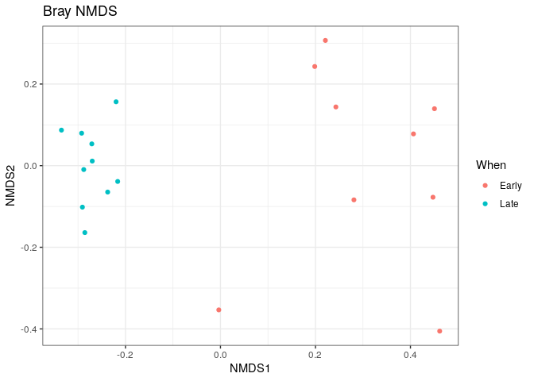

R Notebook
================

``` r
library(dada2); packageVersion("dada2")
```

    ## Loading required package: Rcpp

    ## [1] '1.28.0'

``` r
#library(dada2) → Il charge la bibliothèque dada2 dans R.
#dada2 est un package spécialisé en bioinformatique, utilisé surtout pour analyser des données de séquençage d’ADN (16S, 18S, ITS, etc.) provenant de la microbiologie ou de la métagénomique.
#En clair, il sert à identifier et quantifier les espèces microbiennes présentes dans un échantillon à partir de séquences d’ADN, en nettoyant les erreurs et en regroupant les séquences identiques.
#packageVersion("dada2") → Cette commande affiche la version du package dada2 installée sur ton système.
#Ce code charge l’outil dada2 qui sert à analyser des séquences d’ADN et identifie quelle version de cet outil est installée.
```

``` r
path <- "~/MiSeq_SOP" # CHANGE ME to the directory containing the fastq files after unzipping.
list.files(path)
```

    ##  [1] "F3D0_S188_L001_R1_001.fastq"   "F3D0_S188_L001_R2_001.fastq"  
    ##  [3] "F3D1_S189_L001_R1_001.fastq"   "F3D1_S189_L001_R2_001.fastq"  
    ##  [5] "F3D141_S207_L001_R1_001.fastq" "F3D141_S207_L001_R2_001.fastq"
    ##  [7] "F3D142_S208_L001_R1_001.fastq" "F3D142_S208_L001_R2_001.fastq"
    ##  [9] "F3D143_S209_L001_R1_001.fastq" "F3D143_S209_L001_R2_001.fastq"
    ## [11] "F3D144_S210_L001_R1_001.fastq" "F3D144_S210_L001_R2_001.fastq"
    ## [13] "F3D145_S211_L001_R1_001.fastq" "F3D145_S211_L001_R2_001.fastq"
    ## [15] "F3D146_S212_L001_R1_001.fastq" "F3D146_S212_L001_R2_001.fastq"
    ## [17] "F3D147_S213_L001_R1_001.fastq" "F3D147_S213_L001_R2_001.fastq"
    ## [19] "F3D148_S214_L001_R1_001.fastq" "F3D148_S214_L001_R2_001.fastq"
    ## [21] "F3D149_S215_L001_R1_001.fastq" "F3D149_S215_L001_R2_001.fastq"
    ## [23] "F3D150_S216_L001_R1_001.fastq" "F3D150_S216_L001_R2_001.fastq"
    ## [25] "F3D2_S190_L001_R1_001.fastq"   "F3D2_S190_L001_R2_001.fastq"  
    ## [27] "F3D3_S191_L001_R1_001.fastq"   "F3D3_S191_L001_R2_001.fastq"  
    ## [29] "F3D5_S193_L001_R1_001.fastq"   "F3D5_S193_L001_R2_001.fastq"  
    ## [31] "F3D6_S194_L001_R1_001.fastq"   "F3D6_S194_L001_R2_001.fastq"  
    ## [33] "F3D7_S195_L001_R1_001.fastq"   "F3D7_S195_L001_R2_001.fastq"  
    ## [35] "F3D8_S196_L001_R1_001.fastq"   "F3D8_S196_L001_R2_001.fastq"  
    ## [37] "F3D9_S197_L001_R1_001.fastq"   "F3D9_S197_L001_R2_001.fastq"  
    ## [39] "filtered"                      "HMP_MOCK.v35.fasta"           
    ## [41] "Mock_S280_L001_R1_001.fastq"   "Mock_S280_L001_R2_001.fastq"  
    ## [43] "mouse.dpw.metadata"            "mouse.time.design"            
    ## [45] "stability.batch"               "stability.files"

``` r
#Apres installatio de dada2, Ce code indique à R où se trouvent tes fichiers de séquençage, puis affiche tout ce qu’il y a dans ce dossier pour vérifier que tout est prêt avant l’analyse. C’est une façon rapide de vérifier que R “voit” bien tes fichiers FASTQ, avant de les traiter avec dada2.
```

``` r
# Forward and reverse fastq filenames have format: SAMPLENAME_R1_001.fastq and SAMPLENAME_R2_001.fastq
fnFs <- sort(list.files(path, pattern="_R1_001.fastq", full.names = TRUE))
fnRs <- sort(list.files(path, pattern="_R2_001.fastq", full.names = TRUE))
# Extract sample names, assuming filenames have format: SAMPLENAME_XXX.fastq
sample.names <- sapply(strsplit(basename(fnFs), "_"), `[`, 1)
#Ce code repère automatiquement les fichiers FASTQ “forward” et “reverse” dans ton dossier, puis extrait proprement les noms d’échantillons à partir de leurs noms de fichiers.
#Cela permet à R (et à DADA2) de savoir quel fichier correspond à quel échantillon avant de commencer le traitement des séquences.
```

``` r
plotQualityProfile(fnFs[1:2])
```

<!-- -->

``` r
#Cette commande affiche un graphique de la qualité des bases d’ADN pour tes deux premiers fichiers de séquençage “forward”.fnFs = ta liste de fichiers FASTQ “forward” (R1).fnFs[1:2] → prend les deux premiers fichiers de cette liste (pour ne pas tout afficher d’un coup),plotQualityProfile() → crée un graphique qui montre la qualité des bases (A, T, C, G) le long des séquences.
#Elle te permet de voir où la qualité commence à se dégrader et d’ajuster ensuite le nettoyage de tes données en conséquence.
```

``` r
plotQualityProfile(fnRs[1:2])
```

<!-- -->

``` r
#Cette commande trace le profil de qualité des deux premiers fichiers de séquences reverse.
#Cela te permet de comparer la qualité avec les lectures forward et de décider comment nettoyer (couper ou filtrer) ces lectures avant l’analyse DADA2.
```

``` r
# Place filtered files in filtered/ subdirectory
filtFs <- file.path(path, "filtered", paste0(sample.names, "_F_filt.fastq.gz"))
filtRs <- file.path(path, "filtered", paste0(sample.names, "_R_filt.fastq.gz"))
names(filtFs) <- sample.names
names(filtRs) <- sample.names
#Ce code prépare la structure pour sauvegarder les fichiers FASTQ filtrés (après nettoyage).
#Il crée des chemins vers un dossier filtered/ où seront enregistrées les versions “propres” des séquences forward et reverse, et associe chaque fichier à son échantillon correspondant.filtRs contient les chemins des fichiers “reverse” filtrés,filtFs contient les chemins complets vers les fichiers “forward” filtrés qui seront créés plus tard.
```

``` r
out <- filterAndTrim(fnFs, filtFs, fnRs, filtRs, truncLen=c(240,160),
              maxN=0, maxEE=c(2,2), truncQ=2, rm.phix=TRUE,
              compress=TRUE, multithread=TRUE) # On Windows set multithread=FALSE
head(out)
```

    ##                               reads.in reads.out
    ## F3D0_S188_L001_R1_001.fastq       7793      7113
    ## F3D1_S189_L001_R1_001.fastq       5869      5299
    ## F3D141_S207_L001_R1_001.fastq     5958      5463
    ## F3D142_S208_L001_R1_001.fastq     3183      2914
    ## F3D143_S209_L001_R1_001.fastq     3178      2941
    ## F3D144_S210_L001_R1_001.fastq     4827      4312

``` r
#Ce code lit tes fichiers FASTQ, élimine les séquences de mauvaise qualité, coupe les lectures aux bonnes longueurs, et enregistre les versions “propres” dans un dossier filtered/.
#Le tableau out te dit combien de lectures ont survécu au filtrage pour chaque échantillon.
```

``` r
errF <- learnErrors(filtFs, multithread=TRUE)
```

    ## 33514080 total bases in 139642 reads from 20 samples will be used for learning the error rates.

``` r
#Avant de “deviner” les vraies séquences d’ADN (et non les erreurs), DADA2 doit comprendre à quoi ressemblent les erreurs introduites par la machine de séquençage (Illumina, par exemple).
#Cette commande apprend à DADA2 à reconnaître les erreurs de séquençage dans les fichiers forward.
#En gros, le logiciel regarde comment la machine se trompe, pour ensuite pouvoir “nettoyer” les séquences de manière intelligente.
#C’est une étape de calibration : on apprend le “style d’erreur” du séquenceur avant de corriger les données.
```

``` r
errR <- learnErrors(filtRs, multithread=TRUE)
```

    ## 22342720 total bases in 139642 reads from 20 samples will be used for learning the error rates.

``` r
#Cette commande apprend à DADA2 comment les lectures “reverse” se trompent.
#Elle construit un modèle d’erreurs spécifique à ces fichiers pour que le logiciel puisse ensuite distinguer les vraies séquences biologiques des erreurs techniques.
#En gros : DADA2 “apprend à reconnaître les fautes” dans tes données reverse.
```

``` r
plotErrors(errF, nominalQ=TRUE)
```

    ## Warning: Transformation introduced infinite values in continuous y-axis
    ## Transformation introduced infinite values in continuous y-axis

<!-- -->

``` r
#Cette commande affiche un graphique qui te montre comment DADA2 comprend les erreurs de séquençage dans tes lectures “forward”.
#Si les points (observations réelles) suivent bien les lignes rouges (modèle), cela veut dire que ton modèle d’erreurs est fiable et prêt à être utilisé pour corriger les séquences.
```

``` r
dadaFs <- dada(filtFs, err=errF, multithread=TRUE)
```

    ## Sample 1 - 7113 reads in 1979 unique sequences.
    ## Sample 2 - 5299 reads in 1639 unique sequences.
    ## Sample 3 - 5463 reads in 1477 unique sequences.
    ## Sample 4 - 2914 reads in 904 unique sequences.
    ## Sample 5 - 2941 reads in 939 unique sequences.
    ## Sample 6 - 4312 reads in 1267 unique sequences.
    ## Sample 7 - 6741 reads in 1756 unique sequences.
    ## Sample 8 - 4560 reads in 1438 unique sequences.
    ## Sample 9 - 15637 reads in 3590 unique sequences.
    ## Sample 10 - 11413 reads in 2762 unique sequences.
    ## Sample 11 - 12017 reads in 3021 unique sequences.
    ## Sample 12 - 5032 reads in 1566 unique sequences.
    ## Sample 13 - 18075 reads in 3707 unique sequences.
    ## Sample 14 - 6250 reads in 1479 unique sequences.
    ## Sample 15 - 4052 reads in 1195 unique sequences.
    ## Sample 16 - 7369 reads in 1832 unique sequences.
    ## Sample 17 - 4765 reads in 1183 unique sequences.
    ## Sample 18 - 4871 reads in 1382 unique sequences.
    ## Sample 19 - 6504 reads in 1709 unique sequences.
    ## Sample 20 - 4314 reads in 897 unique sequences.

``` r
#Jusqu’ici, j'ai as :
#Filtré et nettoyé les séquences (filterAndTrim()),
#Appris le modèle d’erreurs (learnErrors()),
#Vérifié ce modèle (plotErrors()).
#Maintenant, DADA2 va utiliser ce modèle d’erreurs pour identifier les “vraies” séquences biologiques présentes dans tes données, en corrigeant les erreurs de séquençage.
#Cette commande fait le “cerveau” du pipeline DADA2 :
#elle lit les séquences filtrées forward, corrige les erreurs en se basant sur le modèle appris (errF), et en déduit quelles sont les vraies séquences d’ADN présentes dans ton échantillon.
#Le résultat (dadaFs) contient les séquences uniques et propres qui reflètent la réalité biologique, pas les fautes du séquenceur.
```

``` r
dadaRs <- dada(filtRs, err=errR, multithread=TRUE)
```

    ## Sample 1 - 7113 reads in 1660 unique sequences.
    ## Sample 2 - 5299 reads in 1349 unique sequences.
    ## Sample 3 - 5463 reads in 1335 unique sequences.
    ## Sample 4 - 2914 reads in 853 unique sequences.
    ## Sample 5 - 2941 reads in 880 unique sequences.
    ## Sample 6 - 4312 reads in 1286 unique sequences.
    ## Sample 7 - 6741 reads in 1803 unique sequences.
    ## Sample 8 - 4560 reads in 1265 unique sequences.
    ## Sample 9 - 15637 reads in 3414 unique sequences.
    ## Sample 10 - 11413 reads in 2522 unique sequences.
    ## Sample 11 - 12017 reads in 2771 unique sequences.
    ## Sample 12 - 5032 reads in 1415 unique sequences.
    ## Sample 13 - 18075 reads in 3290 unique sequences.
    ## Sample 14 - 6250 reads in 1390 unique sequences.
    ## Sample 15 - 4052 reads in 1134 unique sequences.
    ## Sample 16 - 7369 reads in 1635 unique sequences.
    ## Sample 17 - 4765 reads in 1084 unique sequences.
    ## Sample 18 - 4871 reads in 1161 unique sequences.
    ## Sample 19 - 6504 reads in 1502 unique sequences.
    ## Sample 20 - 4314 reads in 732 unique sequences.

``` r
#Cette commande fait pour les lectures “reverse” ce que je viens de faire pour les “forward” :
#elle utilise le modèle d’erreurs (errR) pour corriger les fautes du séquenceur et identifier les vraies séquences biologiques présentes dans chaque échantillon.
```

``` r
dadaFs[[1]]
```

    ## dada-class: object describing DADA2 denoising results
    ## 128 sequence variants were inferred from 1979 input unique sequences.
    ## Key parameters: OMEGA_A = 1e-40, OMEGA_C = 1e-40, BAND_SIZE = 16

``` r
#Cette commande te montre les résultats de la correction d’erreurs pour ton premier échantillon forward.
#Elle affiche combien de lectures ont été traitées et combien de séquences uniques (ASVs) ont été trouvées.
#En gros, c’est un aperçu du “nettoyage” réussi de mes données de séquençage.
```

``` r
mergers <- mergePairs(dadaFs, filtFs, dadaRs, filtRs, verbose=TRUE)
```

    ## 6540 paired-reads (in 107 unique pairings) successfully merged out of 6891 (in 197 pairings) input.

    ## 5028 paired-reads (in 101 unique pairings) successfully merged out of 5190 (in 157 pairings) input.

    ## 4986 paired-reads (in 81 unique pairings) successfully merged out of 5267 (in 166 pairings) input.

    ## 2595 paired-reads (in 52 unique pairings) successfully merged out of 2754 (in 108 pairings) input.

    ## 2553 paired-reads (in 60 unique pairings) successfully merged out of 2785 (in 119 pairings) input.

    ## 3646 paired-reads (in 55 unique pairings) successfully merged out of 4109 (in 157 pairings) input.

    ## 6079 paired-reads (in 81 unique pairings) successfully merged out of 6514 (in 198 pairings) input.

    ## 3968 paired-reads (in 91 unique pairings) successfully merged out of 4388 (in 187 pairings) input.

    ## 14233 paired-reads (in 143 unique pairings) successfully merged out of 15355 (in 352 pairings) input.

    ## 10528 paired-reads (in 120 unique pairings) successfully merged out of 11165 (in 278 pairings) input.

    ## 11154 paired-reads (in 137 unique pairings) successfully merged out of 11797 (in 298 pairings) input.

    ## 4349 paired-reads (in 85 unique pairings) successfully merged out of 4802 (in 179 pairings) input.

    ## 17431 paired-reads (in 153 unique pairings) successfully merged out of 17812 (in 272 pairings) input.

    ## 5850 paired-reads (in 81 unique pairings) successfully merged out of 6095 (in 159 pairings) input.

    ## 3716 paired-reads (in 86 unique pairings) successfully merged out of 3894 (in 147 pairings) input.

    ## 6865 paired-reads (in 99 unique pairings) successfully merged out of 7191 (in 187 pairings) input.

    ## 4426 paired-reads (in 67 unique pairings) successfully merged out of 4603 (in 127 pairings) input.

    ## 4576 paired-reads (in 101 unique pairings) successfully merged out of 4739 (in 174 pairings) input.

    ## 6092 paired-reads (in 109 unique pairings) successfully merged out of 6315 (in 173 pairings) input.

    ## 4269 paired-reads (in 20 unique pairings) successfully merged out of 4281 (in 28 pairings) input.

``` r
# Inspect the merger data.frame from the first sample
head(mergers[[1]])
```

    ##                                                                                                                                                                                                                                                       sequence
    ## 1 TACGGAGGATGCGAGCGTTATCCGGATTTATTGGGTTTAAAGGGTGCGCAGGCGGAAGATCAAGTCAGCGGTAAAATTGAGAGGCTCAACCTCTTCGAGCCGTTGAAACTGGTTTTCTTGAGTGAGCGAGAAGTATGCGGAATGCGTGGTGTAGCGGTGAAATGCATAGATATCACGCAGAACTCCGATTGCGAAGGCAGCATACCGGCGCTCAACTGACGCTCATGCACGAAAGTGTGGGTATCGAACAGG
    ## 2 TACGGAGGATGCGAGCGTTATCCGGATTTATTGGGTTTAAAGGGTGCGTAGGCGGCCTGCCAAGTCAGCGGTAAAATTGCGGGGCTCAACCCCGTACAGCCGTTGAAACTGCCGGGCTCGAGTGGGCGAGAAGTATGCGGAATGCGTGGTGTAGCGGTGAAATGCATAGATATCACGCAGAACCCCGATTGCGAAGGCAGCATACCGGCGCCCTACTGACGCTGAGGCACGAAAGTGCGGGGATCAAACAGG
    ## 3 TACGGAGGATGCGAGCGTTATCCGGATTTATTGGGTTTAAAGGGTGCGTAGGCGGGCTGTTAAGTCAGCGGTCAAATGTCGGGGCTCAACCCCGGCCTGCCGTTGAAACTGGCGGCCTCGAGTGGGCGAGAAGTATGCGGAATGCGTGGTGTAGCGGTGAAATGCATAGATATCACGCAGAACTCCGATTGCGAAGGCAGCATACCGGCGCCCGACTGACGCTGAGGCACGAAAGCGTGGGTATCGAACAGG
    ## 4 TACGGAGGATGCGAGCGTTATCCGGATTTATTGGGTTTAAAGGGTGCGTAGGCGGGCTTTTAAGTCAGCGGTAAAAATTCGGGGCTCAACCCCGTCCGGCCGTTGAAACTGGGGGCCTTGAGTGGGCGAGAAGAAGGCGGAATGCGTGGTGTAGCGGTGAAATGCATAGATATCACGCAGAACCCCGATTGCGAAGGCAGCCTTCCGGCGCCCTACTGACGCTGAGGCACGAAAGTGCGGGGATCGAACAGG
    ## 5 TACGGAGGATGCGAGCGTTATCCGGATTTATTGGGTTTAAAGGGTGCGCAGGCGGACTCTCAAGTCAGCGGTCAAATCGCGGGGCTCAACCCCGTTCCGCCGTTGAAACTGGGAGCCTTGAGTGCGCGAGAAGTAGGCGGAATGCGTGGTGTAGCGGTGAAATGCATAGATATCACGCAGAACTCCGATTGCGAAGGCAGCCTACCGGCGCGCAACTGACGCTCATGCACGAAAGCGTGGGTATCGAACAGG
    ## 6 TACGGAGGATGCGAGCGTTATCCGGATTTATTGGGTTTAAAGGGTGCGTAGGCGGGATGCCAAGTCAGCGGTAAAAAAGCGGTGCTCAACGCCGTCGAGCCGTTGAAACTGGCGTTCTTGAGTGGGCGAGAAGTATGCGGAATGCGTGGTGTAGCGGTGAAATGCATAGATATCACGCAGAACTCCGATTGCGAAGGCAGCATACCGGCGCCCTACTGACGCTGAGGCACGAAAGCGTGGGTATCGAACAGG
    ##   abundance forward reverse nmatch nmismatch nindel prefer accept
    ## 1       579       1       1    148         0      0      1   TRUE
    ## 2       470       2       2    148         0      0      2   TRUE
    ## 3       449       3       4    148         0      0      1   TRUE
    ## 4       430       4       3    148         0      0      2   TRUE
    ## 5       345       5       6    148         0      0      1   TRUE
    ## 6       282       6       5    148         0      0      2   TRUE

``` r
#Cette étape fusionne les lectures avant et arrière pour chaque échantillon.
#DADA2 garde uniquement les paires qui se chevauchent correctement et sans trop d’erreurs.
#Le tableau affiché te montre les premières séquences fusionnées du premier échantillon, avec des infos sur leur qualité et leur fréquence.
```

``` r
seqtab <- makeSequenceTable(mergers)
dim(seqtab)
```

    ## [1]  20 293

``` r
#Ce code regroupe toutes tes séquences fusionnées dans une grande table d’abondances, où chaque colonne représente une séquence unique (ASV) et chaque ligne un échantillon.
#dim(seqtab) te dit combien d’échantillons et combien de séquences différentes tu as obtenus dans ton jeu de données final.
```

``` r
# Inspect distribution of sequence lengths
table(nchar(getSequences(seqtab)))
```

    ## 
    ## 251 252 253 254 255 
    ##   1  88 196   6   2

``` r
#Cette commande compte combien de séquences uniques ont une certaine longueur.
#C’est un contrôle qualité rapide pour vérifier que toutes les séquences inférées ont la taille attendue pour ton gène cible
```

``` r
seqtab.nochim <- removeBimeraDenovo(seqtab, method="consensus", multithread=TRUE, verbose=TRUE)
```

    ## Identified 61 bimeras out of 293 input sequences.

``` r
dim(seqtab.nochim)
```

    ## [1]  20 232

``` r
#Ce code nettoie ta table finale en supprimant les séquences artificielles issues d’erreurs de PCR.
#Le résultat (seqtab.nochim) contient uniquement les vraies séquences biologiques fiables, prêtes pour l’analyse taxonomique.
```

``` r
sum(seqtab.nochim)/sum(seqtab)
```

    ## [1] 0.9640374

``` r
#Cette commande calcule la proportion de lectures qui restent valides après suppression des séquences chimériques.
#Elle te donne une idée de la qualité finale de ton jeu de données : plus le pourcentage est élevé, plus ton échantillon est propre.
```

``` r
getN <- function(x) sum(getUniques(x))
track <- cbind(out, sapply(dadaFs, getN), sapply(dadaRs, getN), sapply(mergers, getN), rowSums(seqtab.nochim))
# If processing a single sample, remove the sapply calls: e.g. replace sapply(dadaFs, getN) with getN(dadaFs)
colnames(track) <- c("input", "filtered", "denoisedF", "denoisedR", "merged", "nonchim")
rownames(track) <- sample.names
head(track)
```

    ##        input filtered denoisedF denoisedR merged nonchim
    ## F3D0    7793     7113      6976      6979   6540    6528
    ## F3D1    5869     5299      5227      5239   5028    5017
    ## F3D141  5958     5463      5331      5357   4986    4863
    ## F3D142  3183     2914      2799      2830   2595    2521
    ## F3D143  3178     2941      2822      2868   2553    2519
    ## F3D144  4827     4312      4151      4228   3646    3507

``` r
#Ce code crée un tableau de suivi qui montre combien de lectures ont survécu à chaque étape du pipeline DADA2 — depuis les fichiers bruts jusqu’aux séquences finales sans chimères.
```

``` r
taxa <- assignTaxonomy(seqtab.nochim, "~/silva_nr99_v138.2_toSpecies_trainset.fa.gz?download=1", multithread=TRUE)
#Cette commande “donne un nom” à chaque séquence d’ADN détectée dans tes échantillons, en identifiant à quel type de bactérie elle appartient, pour que tu puisses analyser la composition microbienne.
```

``` r
taxa.print <- taxa # Removing sequence rownames for display only
rownames(taxa.print) <- NULL
head(taxa.print)
```

    ##      Kingdom    Phylum         Class         Order           Family          
    ## [1,] "Bacteria" "Bacteroidota" "Bacteroidia" "Bacteroidales" "Muribaculaceae"
    ## [2,] "Bacteria" "Bacteroidota" "Bacteroidia" "Bacteroidales" "Muribaculaceae"
    ## [3,] "Bacteria" "Bacteroidota" "Bacteroidia" "Bacteroidales" "Muribaculaceae"
    ## [4,] "Bacteria" "Bacteroidota" "Bacteroidia" "Bacteroidales" "Muribaculaceae"
    ## [5,] "Bacteria" "Bacteroidota" "Bacteroidia" "Bacteroidales" "Bacteroidaceae"
    ## [6,] "Bacteria" "Bacteroidota" "Bacteroidia" "Bacteroidales" "Muribaculaceae"
    ##      Genus         Species     
    ## [1,] NA            NA          
    ## [2,] NA            NA          
    ## [3,] NA            NA          
    ## [4,] NA            NA          
    ## [5,] "Bacteroides" "caecimuris"
    ## [6,] NA            NA

``` r
#Ce code te montre les noms des bactéries (taxonomie) assignés à chaque séquence dans un format lisible.
#Tu peux maintenant voir quels genres ou familles sont présents dans tes échantillons.
```

``` r
library(DECIPHER); packageVersion("DECIPHER")
```

    ## Loading required package: Biostrings

    ## Loading required package: BiocGenerics

    ## 
    ## Attaching package: 'BiocGenerics'

    ## The following objects are masked from 'package:stats':
    ## 
    ##     IQR, mad, sd, var, xtabs

    ## The following objects are masked from 'package:base':
    ## 
    ##     anyDuplicated, aperm, append, as.data.frame, basename, cbind,
    ##     colnames, dirname, do.call, duplicated, eval, evalq, Filter, Find,
    ##     get, grep, grepl, intersect, is.unsorted, lapply, Map, mapply,
    ##     match, mget, order, paste, pmax, pmax.int, pmin, pmin.int,
    ##     Position, rank, rbind, Reduce, rownames, sapply, setdiff, sort,
    ##     table, tapply, union, unique, unsplit, which.max, which.min

    ## Loading required package: S4Vectors

    ## Loading required package: stats4

    ## 
    ## Attaching package: 'S4Vectors'

    ## The following object is masked from 'package:utils':
    ## 
    ##     findMatches

    ## The following objects are masked from 'package:base':
    ## 
    ##     expand.grid, I, unname

    ## Loading required package: IRanges

    ## Loading required package: XVector

    ## Loading required package: GenomeInfoDb

    ## 
    ## Attaching package: 'Biostrings'

    ## The following object is masked from 'package:base':
    ## 
    ##     strsplit

    ## Loading required package: RSQLite

    ## Loading required package: parallel

    ## [1] '2.28.0'

``` r
#Cette commande prépare R pour utiliser DECIPHER et te montre la version installée.
#DECIPHER sera utile pour aligner tes séquences, créer des arbres phylogénétiques, ou faire des analyses plus avancées sur les ASVs que tu as obtenues avec DADA2.
```

``` r
dna <- DNAStringSet(getSequences(seqtab.nochim)) # Create a DNAStringSet from the ASVs
load("~/SILVA_SSU_r138_2_2024.RData") # CHANGE TO THE PATH OF YOUR TRAINING SET
ids <- IdTaxa(dna, trainingSet, strand="top", processors=NULL, verbose=FALSE) # use all processors
ranks <- c("domain", "phylum", "class", "order", "family", "genus", "species") # ranks of interest
# Convert the output object of class "Taxa" to a matrix analogous to the output from assignTaxonomy
taxid <- t(sapply(ids, function(x) {
        m <- match(ranks, x$rank)
        taxa <- x$taxon[m]
        taxa[startsWith(taxa, "unclassified_")] <- NA
        taxa
}))
colnames(taxid) <- ranks; rownames(taxid) <- getSequences(seqtab.nochim)
#Ce code prend tes séquences ASV propres, les compare à un jeu de référence SILVA avec DECIPHER, et construit une table de taxonomie indiquant le domaine, phylum, classe, ordre, famille, genre et espèce pour chaque séquence.
#C’est une manière plus fine et parfois plus précise que assignTaxonomy() pour identifier les bactéries de tes échantillons.
```

``` r
unqs.mock <- seqtab.nochim["Mock",]
unqs.mock <- sort(unqs.mock[unqs.mock>0], decreasing=TRUE) # Drop ASVs absent in the Mock
cat("DADA2 inferred", length(unqs.mock), "sample sequences present in the Mock community.\n")
```

    ## DADA2 inferred 20 sample sequences present in the Mock community.

``` r
#Ce code permet de vérifier combien de séquences distinctes DADA2 a détectées dans le contrôle Mock.
#C’est un bon moyen de valider la performance du pipeline, car tu sais à l’avance quelles bactéries devraient être présentes dans cet échantillon.
```

``` r
mock.ref <- getSequences(file.path(path, "HMP_MOCK.v35.fasta"))
match.ref <- sum(sapply(names(unqs.mock), function(x) any(grepl(x, mock.ref))))
cat("Of those,", sum(match.ref), "were exact matches to the expected reference sequences.\n")
```

    ## Of those, 20 were exact matches to the expected reference sequences.

``` r
#Ce code permet de mesurer la précision de DADA2 sur le contrôle Mock.
#Il te dit combien des séquences détectées sont exactement celles que tu attendais, ce qui est un excellent moyen de valider ton pipeline de traitement et la qualité de tes résultats.
```

``` r
library(phyloseq); packageVersion("phyloseq")
```

    ## 
    ## Attaching package: 'phyloseq'

    ## The following object is masked from 'package:IRanges':
    ## 
    ##     distance

    ## [1] '1.44.0'

``` r
#Cette commande prépare R pour utiliser phyloseq, un package qui te permettra de regrouper toutes tes données (ASVs, taxonomie, échantillons, arbres) dans un seul objet et de les analyser facilement, notamment pour calculer la diversité microbienne et produire des graphiques.
```

``` r
library(Biostrings); packageVersion("Biostrings")
```

    ## [1] '2.68.1'

``` r
#Ce code charge Biostrings, un package de base pour manipuler et analyser les séquences d’ADN, d’ARN ou de protéines dans R.
#Il te fournit les outils nécessaires pour gérer les séquences ASV que tu as générées avec DADA2 et éventuellement pour créer un arbre phylogénétique plus tard.
```

``` r
library(ggplot2); packageVersion("ggplot2")
```

    ## [1] '3.4.3'

``` r
#Cette commande prépare R pour créer des graphiques de haute qualité avec tes données microbiologiques.
#C’est l’outil idéal pour visualiser la composition des échantillons, les différences entre conditions, ou la diversité microbienne de manière claire et esthétique.
```

``` r
theme_set(theme_bw())
#Cette commande configure ggplot2 pour que tous les graphiques que tu crées aient un style clair et épuré, avec un fond blanc et des axes noirs, prêt pour les rapports ou publications.
```

``` r
samples.out <- rownames(seqtab.nochim)
subject <- sapply(strsplit(samples.out, "D"), `[`, 1)
gender <- substr(subject,1,1)
subject <- substr(subject,2,999)
day <- as.integer(sapply(strsplit(samples.out, "D"), `[`, 2))
samdf <- data.frame(Subject=subject, Gender=gender, Day=day)
samdf$When <- "Early"
samdf$When[samdf$Day>100] <- "Late"
rownames(samdf) <- samples.out
#Ce code crée un tableau de métadonnées pour tes échantillons : ID du sujet, genre, jour de prélèvement et période (Early/Late).
#Ce tableau sera utilisé pour annoter les graphiques ou analyser la variation de la microbiome selon le sujet, le genre ou le temps.
```

``` r
ps <- phyloseq(otu_table(seqtab.nochim, taxa_are_rows=FALSE), 
               sample_data(samdf), 
               tax_table(taxa))
ps <- prune_samples(sample_names(ps) != "Mock", ps) # Remove mock sample
#Ce code crée un objet phyloseq complet avec tes données :les ASVs et leur abondance,les taxonomies,les métadonnées des échantillons.
#Ensuite, il retire l’échantillon Mock, car celui-ci est un contrôle et ne doit pas entrer dans l’analyse finale.
```

``` r
dna <- Biostrings::DNAStringSet(taxa_names(ps))
names(dna) <- taxa_names(ps)
ps <- merge_phyloseq(ps, dna)
taxa_names(ps) <- paste0("ASV", seq(ntaxa(ps)))
ps
```

    ## phyloseq-class experiment-level object
    ## otu_table()   OTU Table:         [ 232 taxa and 19 samples ]
    ## sample_data() Sample Data:       [ 19 samples by 4 sample variables ]
    ## tax_table()   Taxonomy Table:    [ 232 taxa by 7 taxonomic ranks ]
    ## refseq()      DNAStringSet:      [ 232 reference sequences ]

``` r
#ce code crée un objet phyloseq complet et prêt à l’analyse en intégrant les séquences d’ADN de chaque ASV (converties en DNAStringSet), les abondances dans chaque échantillon, la taxonomie et les métadonnées. Les noms d’ASVs sont simplifiés en ASV1, ASV2, etc., pour faciliter la manipulation et la lecture. Résultat : un objet structuré contenant toutes les informations nécessaires pour analyser, visualiser et comparer la composition microbienne de tes échantillons.
```

``` r
plot_richness(ps, x="Day", measures=c("Shannon", "Simpson"), color="When")
```

    ## Warning in estimate_richness(physeq, split = TRUE, measures = measures): The data you have provided does not have
    ## any singletons. This is highly suspicious. Results of richness
    ## estimates (for example) are probably unreliable, or wrong, if you have already
    ## trimmed low-abundance taxa from the data.
    ## 
    ## We recommended that you find the un-trimmed data and retry.

<!-- -->

``` r
#Ce graphique montre la diversité interne de chaque échantillon selon deux indices différents, en fonction du jour de prélèvement et de la période (Early ou Late).
#C’est un moyen simple de visualiser si la diversité microbienne change dans le temps ou entre groupes.
```

``` r
# Transform data to proportions as appropriate for Bray-Curtis distances
ps.prop <- transform_sample_counts(ps, function(otu) otu/sum(otu))
ord.nmds.bray <- ordinate(ps.prop, method="NMDS", distance="bray")
```

    ## Run 0 stress 0.08043117 
    ## Run 1 stress 0.08076338 
    ## ... Procrustes: rmse 0.01039205  max resid 0.03196208 
    ## Run 2 stress 0.08076338 
    ## ... Procrustes: rmse 0.01052623  max resid 0.03240008 
    ## Run 3 stress 0.09477202 
    ## Run 4 stress 0.09477102 
    ## Run 5 stress 0.08616064 
    ## Run 6 stress 0.08043116 
    ## ... New best solution
    ## ... Procrustes: rmse 2.84621e-06  max resid 7.565732e-06 
    ## ... Similar to previous best
    ## Run 7 stress 0.08616061 
    ## Run 8 stress 0.08076339 
    ## ... Procrustes: rmse 0.01055044  max resid 0.03247737 
    ## Run 9 stress 0.08616061 
    ## Run 10 stress 0.1212044 
    ## Run 11 stress 0.08076341 
    ## ... Procrustes: rmse 0.01053629  max resid 0.03243201 
    ## Run 12 stress 0.1274325 
    ## Run 13 stress 0.1326155 
    ## Run 14 stress 0.08616061 
    ## Run 15 stress 0.132615 
    ## Run 16 stress 0.08616061 
    ## Run 17 stress 0.08076337 
    ## ... Procrustes: rmse 0.0104238  max resid 0.03206403 
    ## Run 18 stress 0.09477203 
    ## Run 19 stress 0.1320348 
    ## Run 20 stress 0.1442021 
    ## *** Best solution repeated 1 times

``` r
#Ce code prépare les données pour comparer les échantillons entre eux en termes de composition microbienne.
#Les comptages sont transformés en proportions, puis une ordination NMDS est calculée avec la distance de Bray-Curtis, permettant de visualiser les similitudes et différences globales entre échantillons dans un espace 2D ou 3D.
```

``` r
plot_ordination(ps.prop, ord.nmds.bray, color="When", title="Bray NMDS")
```

<!-- -->

``` r
#Ce graphique montre comment les échantillons se regroupent ou se séparent selon leur composition microbienne, en mettant en évidence les différences entre la période Early et Late.
#C’est un moyen simple et visuel de détecter les patterns globaux dans tes données de microbiome.
```

``` r
top20 <- names(sort(taxa_sums(ps), decreasing=TRUE))[1:20]
ps.top20 <- transform_sample_counts(ps, function(OTU) OTU/sum(OTU))
ps.top20 <- prune_taxa(top20, ps.top20)
plot_bar(ps.top20, x="Day", fill="Family") + facet_wrap(~When, scales="free_x")
```

<!-- -->

``` r
#Ce code produit un barplot coloré des 20 familles bactériennes les plus abondantes, montrant leur proportion dans chaque échantillon, séparé en Early et Late.
#C’est une manière claire de visualiser la composition microbienne et ses variations dans le temps
```
