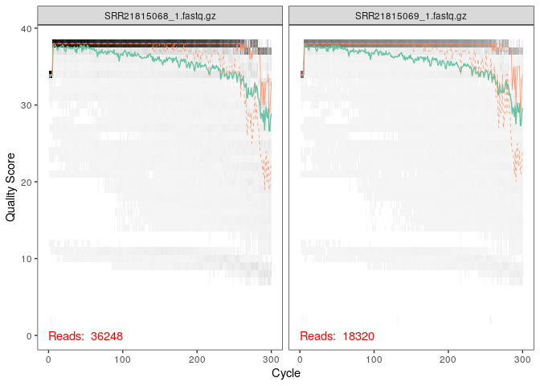
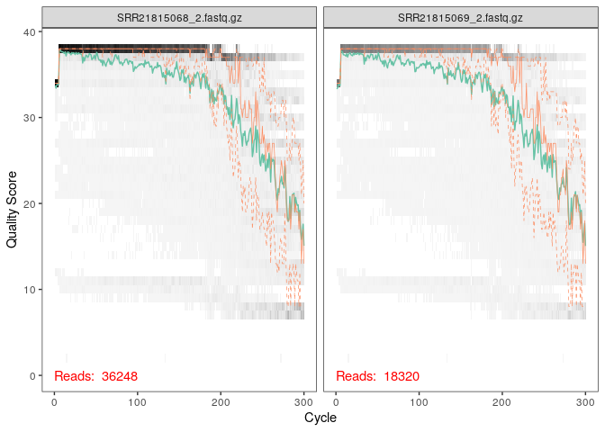
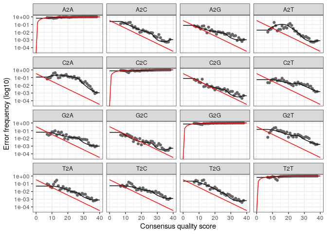
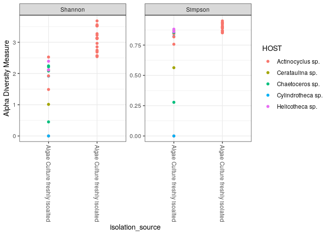
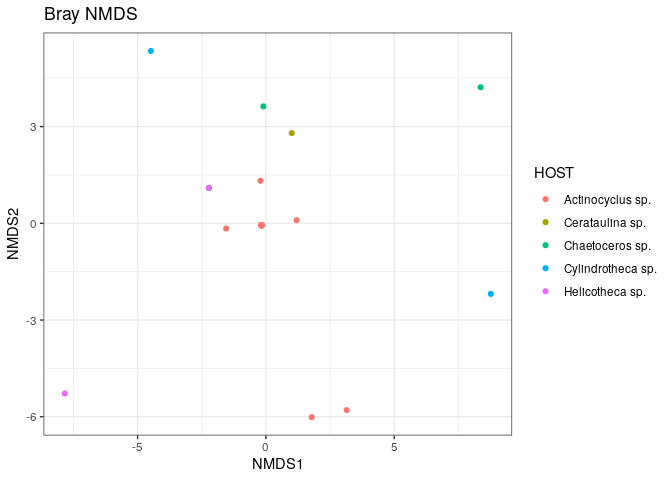
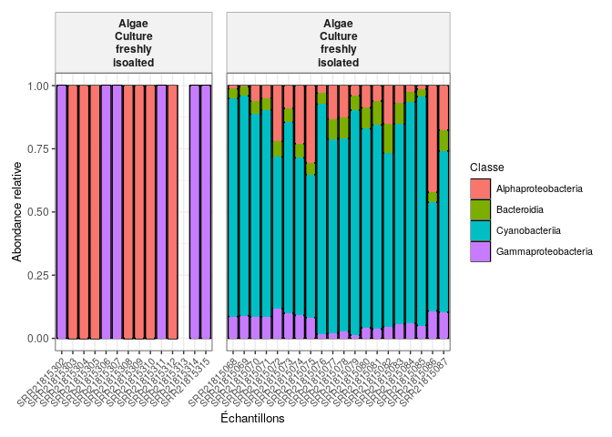

**FREMORY CAMARA et ABDOUL AZIZ MALICK DIALLO, master1 MFA, ADM**
================

Introduction: Les diatomées sont de minuscules algues qui vivent presque
partout près de la surface des océans, des lacs et des rivières. Ils
restent près de la surface car, comme toute plante, ils ont besoin de
lumière pour produire de l’énergie par le biais du processus de
photosynthèse Les interactions entre les diatomées et les bactéries
façonnent la dynamique des communautés microbiennes et ont d’importantes
implications écologiques, car elles influencent les processus
biologiques et chimiques qui structurent le réseau trophique marin et
régissent le cycle biogéochimique. (Falkowski et coll., 1998; Field et
al., 1998; Liu et coll., 2019; Le Reun et al., 2022).

Les diatomées exsudent du carbone organique dissous (COD) qui alimente
la croissance des bactéries hétérotrophes, qui reminéralisent ensuite
ces composés organiques et favorisent ainsi potentiellement la
production primaire (Azam et Malfatti, 2007; Falkowski et coll., 2008;
Worden et coll., 2015). Méthode: Ils ont isolé et identifié la diatomée
Actinocyclus sp. ainsi que ses bactéries associées par séquençage et
microscopie. Ils ont ensuite créé une culture axénique puis testé
différentes souches bactériennes en co-culture pour observer leur effet
sur la croissance de la diatomée, suivie par cytométrie en flux et
analyses statistiques.

Objectif de l’étude L’étude visait à savoir quelles bactéries stimulent
la croissance de Actinocyclus, dans quelle mesure et à quel moment du
cycle de vie ces effets se produisent.

``` r
library(dada2); packageVersion("dada2")
```

    ## Loading required package: Rcpp

    ## [1] '1.28.0'

``` r
path <- "~/myarticle" # CHANGE ME to the directory containing the fastq files after unzipping.
list.files(path)
```

    ##  [1] "ena-file-download-read_run-PRJNA885573-fastq_ftp-20251026-1038.sh"
    ##  [2] "filtered"                                                         
    ##  [3] "SraRunTable.csv"                                                  
    ##  [4] "SRR21815068_1.fastq.gz"                                           
    ##  [5] "SRR21815068_2.fastq.gz"                                           
    ##  [6] "SRR21815069_1.fastq.gz"                                           
    ##  [7] "SRR21815069_2.fastq.gz"                                           
    ##  [8] "SRR21815070_1.fastq.gz"                                           
    ##  [9] "SRR21815070_2.fastq.gz"                                           
    ## [10] "SRR21815071_1.fastq.gz"                                           
    ## [11] "SRR21815071_2.fastq.gz"                                           
    ## [12] "SRR21815072_1.fastq.gz"                                           
    ## [13] "SRR21815072_2.fastq.gz"                                           
    ## [14] "SRR21815073_1.fastq.gz"                                           
    ## [15] "SRR21815073_2.fastq.gz"                                           
    ## [16] "SRR21815074_1.fastq.gz"                                           
    ## [17] "SRR21815074_2.fastq.gz"                                           
    ## [18] "SRR21815075_1.fastq.gz"                                           
    ## [19] "SRR21815075_2.fastq.gz"                                           
    ## [20] "SRR21815076_1.fastq.gz"                                           
    ## [21] "SRR21815076_2.fastq.gz"                                           
    ## [22] "SRR21815077_1.fastq.gz"                                           
    ## [23] "SRR21815077_2.fastq.gz"                                           
    ## [24] "SRR21815078_1.fastq.gz"                                           
    ## [25] "SRR21815078_2.fastq.gz"                                           
    ## [26] "SRR21815079_1.fastq.gz"                                           
    ## [27] "SRR21815079_2.fastq.gz"                                           
    ## [28] "SRR21815080_1.fastq.gz"                                           
    ## [29] "SRR21815080_2.fastq.gz"                                           
    ## [30] "SRR21815081_1.fastq.gz"                                           
    ## [31] "SRR21815081_2.fastq.gz"                                           
    ## [32] "SRR21815082_1.fastq.gz"                                           
    ## [33] "SRR21815082_2.fastq.gz"                                           
    ## [34] "SRR21815083_1.fastq.gz"                                           
    ## [35] "SRR21815083_2.fastq.gz"                                           
    ## [36] "SRR21815084_1.fastq.gz"                                           
    ## [37] "SRR21815084_2.fastq.gz"                                           
    ## [38] "SRR21815085_1.fastq.gz"                                           
    ## [39] "SRR21815085_2.fastq.gz"                                           
    ## [40] "SRR21815086_1.fastq.gz"                                           
    ## [41] "SRR21815086_2.fastq.gz"                                           
    ## [42] "SRR21815087_1.fastq.gz"                                           
    ## [43] "SRR21815087_2.fastq.gz"                                           
    ## [44] "SRR21815302_1.fastq.gz"                                           
    ## [45] "SRR21815302_2.fastq.gz"                                           
    ## [46] "SRR21815302.final_EE26.265_255"                                   
    ## [47] "SRR21815302.trimmed"                                              
    ## [48] "SRR21815303_1.fastq.gz"                                           
    ## [49] "SRR21815303_2.fastq.gz"                                           
    ## [50] "SRR21815304_1.fastq.gz"                                           
    ## [51] "SRR21815304_2.fastq.gz"                                           
    ## [52] "SRR21815305_1.fastq.gz"                                           
    ## [53] "SRR21815305_2.fastq.gz"                                           
    ## [54] "SRR21815306_1.fastq.gz"                                           
    ## [55] "SRR21815306_2.fastq.gz"                                           
    ## [56] "SRR21815307_1.fastq.gz"                                           
    ## [57] "SRR21815307_2.fastq.gz"                                           
    ## [58] "SRR21815308_1.fastq.gz"                                           
    ## [59] "SRR21815308_2.fastq.gz"                                           
    ## [60] "SRR21815309_1.fastq.gz"                                           
    ## [61] "SRR21815309_2.fastq.gz"                                           
    ## [62] "SRR21815310_1.fastq.gz"                                           
    ## [63] "SRR21815310_2.fastq.gz"                                           
    ## [64] "SRR21815311_1.fastq.gz"                                           
    ## [65] "SRR21815311_2.fastq.gz"                                           
    ## [66] "SRR21815312_1.fastq.gz"                                           
    ## [67] "SRR21815312_2.fastq.gz"                                           
    ## [68] "SRR21815313_1.fastq.gz"                                           
    ## [69] "SRR21815313_2.fastq.gz"                                           
    ## [70] "SRR21815314_1.fastq.gz"                                           
    ## [71] "SRR21815314_2.fastq.gz"                                           
    ## [72] "SRR21815315_1.fastq.gz"                                           
    ## [73] "SRR21815315_2.fastq.gz"

``` r
#Apres installation de dada2, Ce code indique à R où se trouvent mes fichiers de séquençage, puis affiche tout ce qu’il y a dans ce dossier pour vérifier que tout est prêt avant l’analyse. C’est une façon rapide de vérifier que R “voit” bien mes fichiers FASTQ, avant de les traiter avec dada2.
#On peut voir ci dessus qu'après avoir lancé le code, j'ai obtenue la liste des sequences présent dans mon fichier
```

``` r
# Forward and reverse fastq filenames have format: SAMPLENAME_R1_001.fastq and SAMPLENAME_R2_001.fastq
fnFs <- sort(list.files(path, pattern="_1.fastq", full.names = TRUE))
fnRs <- sort(list.files(path, pattern="_2.fastq", full.names = TRUE))
# Extract sample names, assuming filenames have format: SAMPLENAME_XXX.fastq
sample.names <- sapply(strsplit(basename(fnFs), "_"), `[`, 1)
#Ce code repère automatiquement les fichiers FASTQ “forward” et “reverse” dans mon dossier, puis extrait proprement les noms d’échantillons à partir de leurs noms de fichiers.
#Cela permet à R (et à DADA2) de savoir quel fichier correspond à quel échantillon avant de commencer le traitement des séquences.
```

``` r
plotQualityProfile(fnFs[1:2])
```

<!-- -->

``` r
#Cette commande affiche un graphique de la qualité des bases d’ADN pour tes deux premiers fichiers de séquençage “forward”.fnFs = ma liste de fichiers FASTQ “forward” (R1).fnFs[1:2] → prend les deux premiers fichiers de cette liste (pour ne pas tout afficher d’un coup),plotQualityProfile() → crée un graphique qui montre la qualité des bases (A, T, C, G) le long des séquences.
#Elle te permet de voir où la qualité commence à se dégrader et d’ajuster ensuite le nettoyage de tes données en conséquence.
#sur le grave on peut voir que la qualité commence à se degrader à partir de Q=270 pour les séquences forwards
```

``` r
plotQualityProfile(fnRs[1:2])
```

<!-- -->

``` r
#Cette commande trace le profil de qualité des deux premiers fichiers de séquences reverse.
#Cela te permet de comparer la qualité avec les lectures forward et de décider comment nettoyer (couper ou filtrer) ces lectures avant l’analyse DADA2.
#sur le grave on peut voir que la qualité commence à se degrader à partir de Q=250 pour les séquences reverses
```

5

``` r
# Place filtered files in filtered/ subdirectory
filtFs <- file.path(path, "filtered", paste0(sample.names, "_F_filt.fastq.gz"))
filtRs <- file.path(path, "filtered", paste0(sample.names, "_R_filt.fastq.gz"))
names(filtFs) <- sample.names
names(filtRs) <- sample.names
#Ce code prépare la structure pour sauvegarder les fichiers FASTQ filtrés (après nettoyage).
#Il crée des chemins vers un dossier filtered/ où seront enregistrées les versions “propres” des séquences forward et reverse, et associe chaque fichier à son échantillon correspondant.filtRs contient les chemins des fichiers “reverse” filtrés,filtFs contient les chemins complets vers les fichiers “forward” filtrés qui seront créés plus tard.
```

``` r
out <- filterAndTrim(fnFs, filtFs, fnRs, filtRs, truncLen=c(270,250),
              maxN=0, maxEE=c(2,2), truncQ=2, rm.phix=TRUE,
              compress=TRUE, multithread=FALSE) # On Windows set multithread=FALSE
head(out)
```

    ##                        reads.in reads.out
    ## SRR21815068_1.fastq.gz    36248     28034
    ## SRR21815069_1.fastq.gz    18320     14085
    ## SRR21815070_1.fastq.gz    53547     40255
    ## SRR21815071_1.fastq.gz    54611     39839
    ## SRR21815072_1.fastq.gz    44852     32799
    ## SRR21815073_1.fastq.gz    45439     33584

``` r
#Après le plotQualityProfile on abtenue les scores de qualité ^puis on utilise ces données pour ce code pour filtrer mes fichiers
#Ce code lit tes fichiers FASTQ, élimine les séquences de mauvaise qualité, coupe les lectures aux bonnes longueurs, et enregistre les versions “propres” dans un dossier filtered/.
#Le tableau out te dit combien de lectures ont survécu au filtrage pour chaque échantillon.
```

``` r
errF <- learnErrors(filtFs, multithread=TRUE)
```

    ## 101396880 total bases in 375544 reads from 12 samples will be used for learning the error rates.

``` r
#Avant de “deviner” les vraies séquences d’ADN, DADA2 doit comprendre à quoi ressemblent les erreurs introduites par la machine de séquençage (Illumina, par exemple).
#Cette commande apprend à DADA2 à reconnaître les erreurs de séquençage dans les fichiers forward.
#En gros, le logiciel regarde comment la machine se trompe, pour ensuite pouvoir “nettoyer” les séquences de manière intelligente.
#C’est une étape de calibration : on apprend le “style d’erreur” du séquenceur avant de corriger les données.
```

``` r
errR <- learnErrors(filtRs, multithread=TRUE)
```

    ## 100259250 total bases in 401037 reads from 14 samples will be used for learning the error rates.

``` r
#c'est le même principe avec le code précédent 
#Cette commande apprend à DADA2 comment les lectures “reverse” se trompent.
#Elle construit un modèle d’erreurs spécifique à ces fichiers pour que le logiciel puisse ensuite distinguer les vraies séquences biologiques des erreurs techniques.
#En gros : DADA2 “apprend à reconnaître les fautes” dans tes données reverse.
```

``` r
plotErrors(errF, nominalQ=TRUE)
```

    ## Warning: Transformation introduced infinite values in continuous y-axis

<!-- -->

``` r
#Cette commande affiche un graphique qui te montre comment DADA2 comprend les erreurs de séquençage dans tes lectures “forward”.
#Si les points (observations réelles) suivent bien les lignes rouges (modèle), cela veut dire que ton modèle d’erreurs est fiable et prêt à être utilisé pour corriger les séquences.
```

``` r
dadaFs <- dada(filtFs, err=errF, multithread=TRUE)
```

    ## Sample 1 - 28034 reads in 6567 unique sequences.
    ## Sample 2 - 14085 reads in 3588 unique sequences.
    ## Sample 3 - 40255 reads in 10050 unique sequences.
    ## Sample 4 - 39839 reads in 9477 unique sequences.
    ## Sample 5 - 32799 reads in 8612 unique sequences.
    ## Sample 6 - 33584 reads in 8531 unique sequences.
    ## Sample 7 - 31083 reads in 8418 unique sequences.
    ## Sample 8 - 35669 reads in 9530 unique sequences.
    ## Sample 9 - 29299 reads in 5206 unique sequences.
    ## Sample 10 - 36159 reads in 7854 unique sequences.
    ## Sample 11 - 28682 reads in 6542 unique sequences.
    ## Sample 12 - 26056 reads in 4961 unique sequences.
    ## Sample 13 - 13364 reads in 3584 unique sequences.
    ## Sample 14 - 12129 reads in 3044 unique sequences.
    ## Sample 15 - 18095 reads in 4705 unique sequences.
    ## Sample 16 - 17885 reads in 4456 unique sequences.
    ## Sample 17 - 34289 reads in 6691 unique sequences.
    ## Sample 18 - 45687 reads in 8063 unique sequences.
    ## Sample 19 - 24027 reads in 6732 unique sequences.
    ## Sample 20 - 22747 reads in 6510 unique sequences.
    ## Sample 21 - 47002 reads in 8993 unique sequences.
    ## Sample 22 - 77918 reads in 9049 unique sequences.
    ## Sample 23 - 85206 reads in 9368 unique sequences.
    ## Sample 24 - 72706 reads in 6734 unique sequences.
    ## Sample 25 - 24850 reads in 3117 unique sequences.
    ## Sample 26 - 91141 reads in 8758 unique sequences.
    ## Sample 27 - 55515 reads in 7698 unique sequences.
    ## Sample 28 - 62305 reads in 8010 unique sequences.
    ## Sample 29 - 76869 reads in 10142 unique sequences.
    ## Sample 30 - 43791 reads in 7658 unique sequences.
    ## Sample 31 - 73630 reads in 12288 unique sequences.
    ## Sample 32 - 77809 reads in 10339 unique sequences.
    ## Sample 33 - 42855 reads in 9391 unique sequences.
    ## Sample 34 - 78467 reads in 11448 unique sequences.

``` r
#Jusqu’ici, j'ai :
#Filtré et nettoyé les séquences,
#Appris le modèle d’erreurs,
#Vérifié ce modèle (plotErrors()).
#Maintenant, DADA2 va utiliser ce modèle d’erreurs pour identifier les “vraies” séquences biologiques présentes dans tes données, en corrigeant les erreurs de séquençage.
#Cette commande fait le “cerveau” du pipeline DADA2 :
#elle lit les séquences filtrées forward, corrige les erreurs en se basant sur le modèle appris (errF), et en déduit quelles sont les vraies séquences d’ADN présentes dans ton échantillon.
#Le résultat (dadaFs) contient les séquences uniques et propres qui reflètent la réalité biologique, pas les fautes du séquenceur.
```

``` r
dadaRs <- dada(filtRs, err=errR, multithread=TRUE)
```

    ## Sample 1 - 28034 reads in 9332 unique sequences.
    ## Sample 2 - 14085 reads in 5080 unique sequences.
    ## Sample 3 - 40255 reads in 14611 unique sequences.
    ## Sample 4 - 39839 reads in 14970 unique sequences.
    ## Sample 5 - 32799 reads in 13056 unique sequences.
    ## Sample 6 - 33584 reads in 12439 unique sequences.
    ## Sample 7 - 31083 reads in 12526 unique sequences.
    ## Sample 8 - 35669 reads in 13390 unique sequences.
    ## Sample 9 - 29299 reads in 8846 unique sequences.
    ## Sample 10 - 36159 reads in 13005 unique sequences.
    ## Sample 11 - 28682 reads in 11114 unique sequences.
    ## Sample 12 - 26056 reads in 8821 unique sequences.
    ## Sample 13 - 13364 reads in 6062 unique sequences.
    ## Sample 14 - 12129 reads in 4832 unique sequences.
    ## Sample 15 - 18095 reads in 7756 unique sequences.
    ## Sample 16 - 17885 reads in 7265 unique sequences.
    ## Sample 17 - 34289 reads in 10602 unique sequences.
    ## Sample 18 - 45687 reads in 12723 unique sequences.
    ## Sample 19 - 24027 reads in 10489 unique sequences.
    ## Sample 20 - 22747 reads in 10040 unique sequences.
    ## Sample 21 - 47002 reads in 8143 unique sequences.
    ## Sample 22 - 77918 reads in 14607 unique sequences.
    ## Sample 23 - 85206 reads in 9301 unique sequences.
    ## Sample 24 - 72706 reads in 9918 unique sequences.
    ## Sample 25 - 24850 reads in 4011 unique sequences.
    ## Sample 26 - 91141 reads in 10393 unique sequences.
    ## Sample 27 - 55515 reads in 14165 unique sequences.
    ## Sample 28 - 62305 reads in 11673 unique sequences.
    ## Sample 29 - 76869 reads in 14992 unique sequences.
    ## Sample 30 - 43791 reads in 5863 unique sequences.
    ## Sample 31 - 73630 reads in 17461 unique sequences.
    ## Sample 32 - 77809 reads in 11891 unique sequences.
    ## Sample 33 - 42855 reads in 7006 unique sequences.
    ## Sample 34 - 78467 reads in 13109 unique sequences.

``` r
#Cette commande fait pour les lectures “reverse” ce que je viens de faire pour les “forward” :
#elle utilise le modèle d’erreurs (errR) pour corriger les fautes du séquenceur et identifier les vraies séquences biologiques présentes dans chaque échantillon.
```

``` r
dadaFs[[1]]
```

    ## dada-class: object describing DADA2 denoising results
    ## 101 sequence variants were inferred from 6567 input unique sequences.
    ## Key parameters: OMEGA_A = 1e-40, OMEGA_C = 1e-40, BAND_SIZE = 16

``` r
#Cette commande te montre les résultats de la correction d’erreurs pour ton premier échantillon forward.
#Elle affiche combien de lectures ont été traitées et combien de séquences uniques (ASVs) ont été trouvées.
#En gros, c’est un aperçu du “nettoyage” réussi de mes données de séquençage.
```

``` r
mergers <- mergePairs(dadaFs, filtFs, dadaRs, filtRs, verbose=TRUE)
```

    ## 15901 paired-reads (in 501 unique pairings) successfully merged out of 27433 (in 2048 pairings) input.

    ## 8971 paired-reads (in 266 unique pairings) successfully merged out of 13803 (in 1039 pairings) input.

    ## 20633 paired-reads (in 1091 unique pairings) successfully merged out of 39348 (in 3986 pairings) input.

    ## 20561 paired-reads (in 1017 unique pairings) successfully merged out of 38958 (in 3962 pairings) input.

    ## 12817 paired-reads (in 876 unique pairings) successfully merged out of 32044 (in 3535 pairings) input.

    ## 13727 paired-reads (in 696 unique pairings) successfully merged out of 32749 (in 3072 pairings) input.

    ## 12238 paired-reads (in 758 unique pairings) successfully merged out of 29988 (in 3441 pairings) input.

    ## 13270 paired-reads (in 831 unique pairings) successfully merged out of 34695 (in 3681 pairings) input.

    ## 21482 paired-reads (in 385 unique pairings) successfully merged out of 28772 (in 1409 pairings) input.

    ## 21499 paired-reads (in 863 unique pairings) successfully merged out of 35324 (in 2677 pairings) input.

    ## 16128 paired-reads (in 691 unique pairings) successfully merged out of 28009 (in 2237 pairings) input.

    ## 18074 paired-reads (in 370 unique pairings) successfully merged out of 25511 (in 1248 pairings) input.

    ## 7594 paired-reads (in 290 unique pairings) successfully merged out of 12938 (in 1044 pairings) input.

    ## 6988 paired-reads (in 220 unique pairings) successfully merged out of 11619 (in 784 pairings) input.

    ## 8904 paired-reads (in 450 unique pairings) successfully merged out of 17573 (in 1588 pairings) input.

    ## 9877 paired-reads (in 417 unique pairings) successfully merged out of 17400 (in 1578 pairings) input.

    ## 22786 paired-reads (in 558 unique pairings) successfully merged out of 33532 (in 2030 pairings) input.

    ## 30700 paired-reads (in 682 unique pairings) successfully merged out of 44374 (in 2487 pairings) input.

    ## 9543 paired-reads (in 659 unique pairings) successfully merged out of 23341 (in 2573 pairings) input.

    ## 9000 paired-reads (in 604 unique pairings) successfully merged out of 22136 (in 2773 pairings) input.

    ## 37 paired-reads (in 11 unique pairings) successfully merged out of 46941 (in 370 pairings) input.

    ## 75949 paired-reads (in 42 unique pairings) successfully merged out of 77540 (in 77 pairings) input.

    ## 84445 paired-reads (in 21 unique pairings) successfully merged out of 84765 (in 31 pairings) input.

    ## 72325 paired-reads (in 26 unique pairings) successfully merged out of 72576 (in 40 pairings) input.

    ## 47 paired-reads (in 1 unique pairings) successfully merged out of 24753 (in 9 pairings) input.

    ## 331 paired-reads (in 7 unique pairings) successfully merged out of 90912 (in 64 pairings) input.

    ## 55192 paired-reads (in 55 unique pairings) successfully merged out of 55348 (in 60 pairings) input.

    ## 62208 paired-reads (in 183 unique pairings) successfully merged out of 62224 (in 188 pairings) input.

    ## 72720 paired-reads (in 41 unique pairings) successfully merged out of 76393 (in 94 pairings) input.

    ## 6 paired-reads (in 2 unique pairings) successfully merged out of 43765 (in 106 pairings) input.

    ## 69213 paired-reads (in 34 unique pairings) successfully merged out of 73503 (in 83 pairings) input.

    ## 293 paired-reads (in 1 unique pairings) successfully merged out of 77666 (in 118 pairings) input.

    ## 40 paired-reads (in 13 unique pairings) successfully merged out of 42788 (in 397 pairings) input.

    ## 454 paired-reads (in 22 unique pairings) successfully merged out of 78378 (in 360 pairings) input.

``` r
# Inspect the merger data.frame from the first sample
head(mergers[[1]])
```

    ##                                                                                                                                                                                                                                                                                                                                                                                                                                                                                           sequence
    ## 1  AGAGTTTGATCATGGCTCAGGATGAACGCTGGCGGTATGCCTAACACATGCAAGTCGTACGAGAGTATTTATACTCAAGTGGCGGACGGGTGAGTAACACGTGAGAATTTGCCTTTAGGAGGGGGATAACAATTGGAAACGATTGCTAATACCCCATATGCTTGAGAGTGAAATAGATTTATCTGCCTAAAGAAAAGCTCGCGGCTGATTAGCTAGTTGGTAAGGTAATGGCTTACCAAGGCGACGATCAGTATCTGGTTTGAGAGGACGATCAGACACACTGGAACTGAGACACGGTCCAGACTCCTACGGGAGGCAGCAGTGGGGAATTTTCCGCAATGGGCGAAAGCCTGACGGAGCAATACCGCGTGAGGGAAGACGGCCTATGGGTTGTAAACCTCTTTTTTCAGGGAGGAATCAATGACGTGTACCTGAAGAATAAGCATCGGCTAACTCCGTGCCAGCAGCCGCGGTAATAC
    ## 2  AGAGTTTGATCATGGCTCAGGATGAACGCTGGCGGTATGCCTAACACATGCAAGTCGTACGAGAGTATTTATACTCAAGTGGCGGACGGGTGAGTAACACGTGAGAATTTGCCTTTAGGAGGGGGATAACAATTGGAAACGATTGCTAATACCCCATATGCTTGAGAGTGAAATAGATTTATCTGCCTAAAGAAAAGCTCGCGGCTGATTAGCTAGTTGGTAAGGTAATGGCTTACCAAGGCGACGATCAGTATCTGGTTTGAGAGGACGATCAGACACACTGGAACTGAGACACGGTCCAGACTCCTACGGGAGGCAGCAGTGGGGAATTTTCCGCAATGGGCGAAAGCCTGACGGAGCAATACCGCGTGAGGGAAGACGGCCTATGGGTTGTAAACCTCTTTTTTCAGGGAGGAATCAATGACGTGTACCTGAAGAATAAGCATCGGCTAACTCCGTGCCAGCAGCCGCGGTAATTC
    ## 3  AGAGTTTGATCCTGGCTCAGGATGAACGCTGGCGGTATGCCTAACACATGCAAGTCGTACGAGAGTATTTATACTCAAGTGGCGGACGGGTGAGTAACACGTGAGAATTTGCCTTTAGGAGGGGGATAACAATTGGAAACGATTGCTAATACCCCATATGCTTGAGAGTGAAATAGATTTATCTGCCTAAAGAAAAGCTCGCGGCTGATTAGCTAGTTGGTAAGGTAATGGCTTACCAAGGCGACGATCAGTATCTGGTTTGAGAGGACGATCAGACACACTGGAACTGAGACACGGTCCAGACTCCTACGGGAGGCAGCAGTGGGGAATTTTCCGCAATGGGCGAAAGCCTGACGGAGCAATACCGCGTGAGGGAAGACGGCCTATGGGTTGTAAACCTCTTTTTTCAGGGAGGAATCAATGACGTGTACCTGAAGAATAAGCATCGGCTAACTCCGTGCCAGCAGCCGCGGTAATAC
    ## 4  AGAGTTTGATCCTGGCTCAGGATGAACGCTGGCGGTATGCCTAACACATGCAAGTCGTACGAGAGTATTTATACTCAAGTGGCGGACGGGTGAGTAACACGTGAGAATTTGCCTTTAGGAGGGGGATAACAATTGGAAACGATTGCTAATACCCCATATGCTTGAGAGTGAAATAGATTTATCTGCCTAAAGAAAAGCTCGCGGCTGATTAGCTAGTTGGTAAGGTAATGGCTTACCAAGGCGACGATCAGTATCTGGTTTGAGAGGACGATCAGACACACTGGAACTGAGACACGGTCCAGACTCCTACGGGAGGCAGCAGTGGGGAATTTTCCGCAATGGGCGAAAGCCTGACGGAGCAATACCGCGTGAGGGAAGACGGCCTATGGGTTGTAAACCTCTTTTTTCAGGGAGGAATCAATGACGTGTACCTGAAGAATAAGCATCGGCTAACTCCGTGCCAGCAGCCGCGGTAATTC
    ## 11 AGAGTTTGATCATGGCTCAGGATGAACGCTGGCGGTATGCCTAACACATGCAAGTCGTACGAGAGTATTTATACTCAAGTGGCGGACGGGTGAGTAACACGTGAGAATTTGCCTTTAGGAGGGGGATAACAATTGGAAACGATTGCTAATACCCCATATGCTTGAGAGTGAAATAGATTTATCTGCCTAAAGAAAAGCTCGCGGCTGATTAGCTAGTTGGTAAGGTAATGGCTTACCAAGGCGACGATCAGTATCTGGTTTGAGAGGACGATCAGACACACTGGAACTGAGACACGGTCCAGACTCCTACGGGAGGCAGCAGTGGGGAATTTTCCGCAATGGGCGAAAGCCTGACGGAGCAATACCGCGTGAGGGAAGACGGCCTATGGGTTGTAAACCTCTTTTTTCAGGGAGGAATCAATGACGTGTACCTGAAGAATAAGCATCGGCTAACTCCGTGCCAGCCGCCGCGGTAATAC
    ## 12 AGAGTTTGATCATGGCTCAGGATGAACGCTGGCGGTATGCCTAACACATGCAAGTCGTACGAGAGTATTTATACTCAAGTGGCGGACGGGTGAGTAACACGTGAGAATTTGCCTTTAGGAGGGGGATAACAATTGGAAACGATTGCTAATACCCCATATGCTTGAGAGTGAAATAGATTTATCTGCCTAAAGAAAAGCTCGCGGCTGATTAGCTAGTTGGTAAGGTAATGGCTTACCAAGGCGACGATCAGTATCTGGTTTGAGAGGACGATCAGACACACTGGAACTGAGACACGGTCCAGACTCCTACGGGAGGCAGCAGTGGGGAATTTTCCGCAATGGGCGAAAGCCTGACGGAGCAATACCGCGTGAGGGAAGACGGCCTATGGGTTGTAAACCTCTTTTTTCAGGGAGGAATCAATGACGTGTACCTGAAGAATAAGCATCGGCTAACTCCGTGCCAGCCGCCGCGGTAATTC
    ##    abundance forward reverse nmatch nmismatch nindel prefer accept
    ## 1       3019       1       1     41         0      0      1   TRUE
    ## 2       2924       1       2     41         0      0      1   TRUE
    ## 3       1805       2       1     41         0      0      2   TRUE
    ## 4       1711       2       2     41         0      0      1   TRUE
    ## 11       390       1       7     41         0      0      1   TRUE
    ## 12       380       1       8     41         0      0      1   TRUE

``` r
#Cette étape fusionne les lectures avant et arrière pour chaque échantillon.
#DADA2 garde uniquement les paires qui se chevauchent correctement et sans trop d’erreurs.
#Le tableau affiché te montre les premières séquences fusionnées du premier échantillon, avec des infos sur leur qualité et leur fréquence.
```

``` r
seqtab <- makeSequenceTable(mergers)
dim(seqtab)
```

    ## [1]   34 4943

``` r
#Ce code regroupe toutes tes séquences fusionnées dans une grande table d’abondances, où chaque colonne représente une séquence unique (ASV) et chaque ligne un échantillon.
#dim(seqtab) te dit combien d’échantillons et combien de séquences différentes tu as obtenus dans ton jeu de données final.
```

``` r
# Inspect distribution of sequence lengths
table(nchar(getSequences(seqtab)))
```

    ## 
    ## 270 273 276 277 278 282 285 286 297 302 312 314 333 337 360 377 382 397 406 413 
    ##   9   1  12   1   1   8   3   1   1  11   1   1 161   1   1   8   3   2   2   1 
    ## 416 419 427 429 430 436 437 438 440 442 443 470 472 473 474 475 476 477 478 479 
    ##  35   6   1  17   1   1   4   1   7   1   5  35 357  20  20 135 180  19   3 167 
    ## 480 482 483 484 485 486 487 488 489 490 491 492 493 494 495 496 497 498 499 500 
    ##  24   2   1  15  12  38  22  97  31  35  78 141  99  28 192 203 533  11  78  34 
    ## 501 502 503 504 505 506 507 508 
    ## 412 534 172  45 494 166  91 111

``` r
#Cette commande compte combien de séquences uniques ont une certaine longueur.
#C’est un contrôle qualité rapide pour vérifier que toutes les séquences inférées ont la taille attendue pour ton gène cible
```

``` r
seqtab.nochim <- removeBimeraDenovo(seqtab, method="consensus", multithread=TRUE, verbose=TRUE)
```

    ## Identified 3994 bimeras out of 4943 input sequences.

``` r
dim(seqtab.nochim)
```

    ## [1]  34 949

``` r
#Ce code nettoie ta table finale en supprimant les séquences artificielles issues d’erreurs de PCR.
#Le résultat (seqtab.nochim) contient uniquement les vraies séquences biologiques fiables, prêtes pour l’analyse taxonomique.
```

``` r
sum(seqtab.nochim)/sum(seqtab)
```

    ## [1] 0.9030862

``` r
#Cette commande calcule la proportion de lectures qui restent valides après suppression des séquences chimériques.
#Elle te donne une idée de la qualité finale de ton jeu de données : plus le pourcentage est élevé, plus ton échantillon est propre.
```

``` r
getN <- function(x) sum(getUniques(x))
track <- cbind(out, sapply(dadaFs, getN), sapply(dadaRs, getN), sapply(mergers, getN), rowSums(seqtab.nochim))
# If processing a single sample, remove the sapply calls: e.g. replace sapply(dadaFs, getN) with getN(dadaFs)
colnames(track) <- c("input", "filtered", "denoisedF", "denoisedR", "merged", "nonchim")
rownames(track) <- sample.names
head(track)
```

    ##             input filtered denoisedF denoisedR merged nonchim
    ## SRR21815068 36248    28034     27701     27724  15901   13651
    ## SRR21815069 18320    14085     13948     13925   8971    7833
    ## SRR21815070 53547    40255     39773     39760  20633   16562
    ## SRR21815071 54611    39839     39398     39320  20561   16742
    ## SRR21815072 44852    32799     32400     32329  12817    9265
    ## SRR21815073 45439    33584     33197     33039  13727   11020

``` r
#Ce code crée un tableau de suivi qui montre combien de lectures ont survécu à chaque étape du pipeline DADA2 — depuis les fichiers bruts jusqu’aux séquences finales sans chimères.
```

``` r
taxa <- assignTaxonomy(seqtab.nochim, "~/silva_nr99_v138.2_toSpecies_trainset.fa.gz?download=1", multithread=TRUE)
#Cette commande “donne un nom” à chaque séquence d’ADN détectée dans tes échantillons, en identifiant à quel type de bactérie elle appartient, pour que tu puisses analyser la composition microbienne.
```

``` r
taxa.print <- taxa # Removing sequence rownames for display only
rownames(taxa.print) <- NULL
head(taxa.print)
```

    ##      Kingdom    Phylum            Class                 Order            
    ## [1,] "Bacteria" "Cyanobacteriota" "Cyanobacteriia"      "Chloroplast"    
    ## [2,] "Bacteria" "Cyanobacteriota" "Cyanobacteriia"      "Chloroplast"    
    ## [3,] "Bacteria" "Pseudomonadota"  "Alphaproteobacteria" "Rhodobacterales"
    ## [4,] "Bacteria" "Pseudomonadota"  "Alphaproteobacteria" "Rhodobacterales"
    ## [5,] "Bacteria" "Pseudomonadota"  "Alphaproteobacteria" "Rhodobacterales"
    ## [6,] "Bacteria" "Cyanobacteriota" "Cyanobacteriia"      "Chloroplast"    
    ##      Family          Genus          Species        
    ## [1,] NA              NA             NA             
    ## [2,] NA              NA             NA             
    ## [3,] "Paracoccaceae" "Thalassobius" "mediterraneus"
    ## [4,] "Paracoccaceae" "Thalassobius" "mediterraneus"
    ## [5,] "Paracoccaceae" "Thalassobius" NA             
    ## [6,] NA              NA             NA

``` r
#Ce code te montre les noms des bactéries (taxonomie) assignés à chaque séquence dans un format lisible.
#Tu peux maintenant voir quels genres ou familles sont présents dans tes échantillons.
```

``` r
library(DECIPHER); packageVersion("DECIPHER")
```

    ## Loading required package: Biostrings

    ## Loading required package: BiocGenerics

    ## 
    ## Attaching package: 'BiocGenerics'

    ## The following objects are masked from 'package:stats':
    ## 
    ##     IQR, mad, sd, var, xtabs

    ## The following objects are masked from 'package:base':
    ## 
    ##     anyDuplicated, aperm, append, as.data.frame, basename, cbind,
    ##     colnames, dirname, do.call, duplicated, eval, evalq, Filter, Find,
    ##     get, grep, grepl, intersect, is.unsorted, lapply, Map, mapply,
    ##     match, mget, order, paste, pmax, pmax.int, pmin, pmin.int,
    ##     Position, rank, rbind, Reduce, rownames, sapply, setdiff, sort,
    ##     table, tapply, union, unique, unsplit, which.max, which.min

    ## Loading required package: S4Vectors

    ## Loading required package: stats4

    ## 
    ## Attaching package: 'S4Vectors'

    ## The following object is masked from 'package:utils':
    ## 
    ##     findMatches

    ## The following objects are masked from 'package:base':
    ## 
    ##     expand.grid, I, unname

    ## Loading required package: IRanges

    ## Loading required package: XVector

    ## Loading required package: GenomeInfoDb

    ## 
    ## Attaching package: 'Biostrings'

    ## The following object is masked from 'package:base':
    ## 
    ##     strsplit

    ## Loading required package: RSQLite

    ## Loading required package: parallel

    ## [1] '2.28.0'

``` r
dna <- DNAStringSet(getSequences(seqtab.nochim)) # Create a DNAStringSet from the ASVs
load("~/SILVA_SSU_r138_2_2024.RData") # CHANGE TO THE PATH OF YOUR TRAINING SET
ids <- IdTaxa(dna, trainingSet, strand="top", processors=NULL, verbose=FALSE) # use all processors
ranks <- c("domain", "phylum", "class", "order", "family", "genus", "species") # ranks of interest
# Convert the output object of class "Taxa" to a matrix analogous to the output from assignTaxonomy
taxid <- t(sapply(ids, function(x) {
        m <- match(ranks, x$rank)
        taxa <- x$taxon[m]
        taxa[startsWith(taxa, "unclassified_")] <- NA
        taxa
}))
colnames(taxid) <- ranks; rownames(taxid) <- getSequences(seqtab.nochim)
#Ce code prend tes séquences ASV propres, les compare à un jeu de référence SILVA avec DECIPHER, et construit une table de taxonomie indiquant le domaine, phylum, classe, ordre, famille, genre et espèce pour chaque séquence.
#C’est une manière plus fine et parfois plus précise que assignTaxonomy() pour identifier les bactéries de tes échantillons.
```

``` r
rownames(seqtab.nochim)
```

    ##  [1] "SRR21815068" "SRR21815069" "SRR21815070" "SRR21815071" "SRR21815072"
    ##  [6] "SRR21815073" "SRR21815074" "SRR21815075" "SRR21815076" "SRR21815077"
    ## [11] "SRR21815078" "SRR21815079" "SRR21815080" "SRR21815081" "SRR21815082"
    ## [16] "SRR21815083" "SRR21815084" "SRR21815085" "SRR21815086" "SRR21815087"
    ## [21] "SRR21815302" "SRR21815303" "SRR21815304" "SRR21815305" "SRR21815306"
    ## [26] "SRR21815307" "SRR21815308" "SRR21815309" "SRR21815310" "SRR21815311"
    ## [31] "SRR21815312" "SRR21815313" "SRR21815314" "SRR21815315"

``` r
library(phyloseq); packageVersion("phyloseq")
```

    ## 
    ## Attaching package: 'phyloseq'

    ## The following object is masked from 'package:IRanges':
    ## 
    ##     distance

    ## [1] '1.44.0'

``` r
#Cette commande prépare R pour utiliser phyloseq, un package qui te permettra de regrouper toutes tes données (ASVs, taxonomie, échantillons, arbres) dans un seul objet et de les analyser facilement, notamment pour calculer la diversité microbienne et produire des graphiques.
```

``` r
library(Biostrings); packageVersion("Biostrings")
```

    ## [1] '2.68.1'

``` r
#Ce code charge Biostrings, un package de base pour manipuler et analyser les séquences d’ADN, d’ARN ou de protéines dans R.
#Il te fournit les outils nécessaires pour gérer les séquences ASV que tu as générées avec DADA2 et éventuellement pour créer un arbre phylogénétique plus tard.
```

``` r
library(ggplot2); packageVersion("ggplot2")
```

    ## [1] '3.4.3'

``` r
#Cette commande prépare R pour créer des graphiques de haute qualité avec tes données microbiologiques.
#C’est l’outil idéal pour visualiser la composition des échantillons, les différences entre conditions, ou la diversité microbienne de manière claire et esthétique
```

``` r
theme_set(theme_bw())
#Cette commande configure ggplot2 pour que tous les graphiques que tu crées aient un style clair et épuré, avec un fond blanc et des axes noirs, prêt pour les rapports ou publications.
```

``` r
# 1. Lire les métadonnées
metadata <- read.csv("~/myarticle/SraRunTable.csv", header=TRUE, sep = ";", row.names = 1)
metadata
```

    ##             Assay.Type AvgSpotLen    Bases  BioProject    BioSample
    ## SRR21815302   AMPLICON        600 37704600 PRJNA885573 SAMN31132491
    ## SRR21815303   AMPLICON        600 58328400 PRJNA885573 SAMN31132490
    ## SRR21815304   AMPLICON        600 62454600 PRJNA885573 SAMN31132489
    ## SRR21815305   AMPLICON        600 54296400 PRJNA885573 SAMN31132488
    ## SRR21815306   AMPLICON        600 19179000 PRJNA885573 SAMN31132487
    ## SRR21815307   AMPLICON        600 68613600 PRJNA885573 SAMN31132486
    ## SRR21815308   AMPLICON        600 43275600 PRJNA885573 SAMN31132485
    ## SRR21815309   AMPLICON        600 46857600 PRJNA885573 SAMN31132484
    ## SRR21815310   AMPLICON        600 56793600 PRJNA885573 SAMN31132495
    ## SRR21815311   AMPLICON        600 33809400 PRJNA885573 SAMN31132494
    ## SRR21815312   AMPLICON        600 57726600 PRJNA885573 SAMN31132493
    ## SRR21815313   AMPLICON        600 61883400 PRJNA885573 SAMN31132492
    ## SRR21815314   AMPLICON        600 33292200 PRJNA885573 SAMN31132483
    ## SRR21815315   AMPLICON        600 63263400 PRJNA885573 SAMN31132482
    ## SRR21815068   AMPLICON        600 21748800 PRJNA885573 SAMN31134634
    ## SRR21815069   AMPLICON        600 10992000 PRJNA885573 SAMN31134633
    ## SRR21815070   AMPLICON        600 32128200 PRJNA885573 SAMN31134632
    ## SRR21815071   AMPLICON        600 32766600 PRJNA885573 SAMN31134631
    ## SRR21815072   AMPLICON        600 26911200 PRJNA885573 SAMN31134630
    ## SRR21815073   AMPLICON        600 27263400 PRJNA885573 SAMN31134629
    ## SRR21815074   AMPLICON        600 26004000 PRJNA885573 SAMN31134628
    ## SRR21815075   AMPLICON        600 29075400 PRJNA885573 SAMN31134627
    ## SRR21815076   AMPLICON        600 22215600 PRJNA885573 SAMN31134644
    ## SRR21815077   AMPLICON        600 27748200 PRJNA885573 SAMN31134643
    ## SRR21815078   AMPLICON        600 23058000 PRJNA885573 SAMN31134642
    ## SRR21815079   AMPLICON        600 20455200 PRJNA885573 SAMN31134641
    ## SRR21815080   AMPLICON        600 11397000 PRJNA885573 SAMN31134640
    ## SRR21815081   AMPLICON        600  9661200 PRJNA885573 SAMN31134639
    ## SRR21815082   AMPLICON        600 14590200 PRJNA885573 SAMN31134638
    ## SRR21815083   AMPLICON        600 14133600 PRJNA885573 SAMN31134637
    ## SRR21815084   AMPLICON        600 26546400 PRJNA885573 SAMN31134636
    ## SRR21815085   AMPLICON        600 35082000 PRJNA885573 SAMN31134635
    ## SRR21815086   AMPLICON        600 20197800 PRJNA885573 SAMN31134626
    ## SRR21815087   AMPLICON        600 19001400 PRJNA885573 SAMN31134625
    ##                                BioSampleModel    Bytes
    ## SRR21815302 Microbe\\, viral or environmental 21705473
    ## SRR21815303 Microbe\\, viral or environmental 30772827
    ## SRR21815304 Microbe\\, viral or environmental 32899814
    ## SRR21815305 Microbe\\, viral or environmental 28541021
    ## SRR21815306 Microbe\\, viral or environmental 10662398
    ## SRR21815307 Microbe\\, viral or environmental 37363099
    ## SRR21815308 Microbe\\, viral or environmental 23436764
    ## SRR21815309 Microbe\\, viral or environmental 24870470
    ## SRR21815310 Microbe\\, viral or environmental 29922245
    ## SRR21815311 Microbe\\, viral or environmental 18882658
    ## SRR21815312 Microbe\\, viral or environmental 31369679
    ## SRR21815313 Microbe\\, viral or environmental 34893061
    ## SRR21815314 Microbe\\, viral or environmental 18961773
    ## SRR21815315 Microbe\\, viral or environmental 36241290
    ## SRR21815068       Metagenome or environmental 11913781
    ## SRR21815069       Metagenome or environmental  6026623
    ## SRR21815070       Metagenome or environmental 17694976
    ## SRR21815071       Metagenome or environmental 18115469
    ## SRR21815072       Metagenome or environmental 14932500
    ## SRR21815073       Metagenome or environmental 15164152
    ## SRR21815074       Metagenome or environmental 14627620
    ## SRR21815075       Metagenome or environmental 16207092
    ## SRR21815076       Metagenome or environmental 11759505
    ## SRR21815077       Metagenome or environmental 14873297
    ## SRR21815078       Metagenome or environmental 12692110
    ## SRR21815079       Metagenome or environmental 11067395
    ## SRR21815080       Metagenome or environmental  6468596
    ## SRR21815081       Metagenome or environmental  5263968
    ## SRR21815082       Metagenome or environmental  8009344
    ## SRR21815083       Metagenome or environmental  7636184
    ## SRR21815084       Metagenome or environmental 14262962
    ## SRR21815085       Metagenome or environmental 18780338
    ## SRR21815086       Metagenome or environmental 11403760
    ## SRR21815087       Metagenome or environmental 10664889
    ##                                    Center.Name Collection_Date Consent
    ## SRR21815302 UNIVERSITY OF TECHNOLOGY OF SYDNEY         2019-05  public
    ## SRR21815303 UNIVERSITY OF TECHNOLOGY OF SYDNEY         2019-05  public
    ## SRR21815304 UNIVERSITY OF TECHNOLOGY OF SYDNEY         2019-05  public
    ## SRR21815305 UNIVERSITY OF TECHNOLOGY OF SYDNEY         2019-05  public
    ## SRR21815306 UNIVERSITY OF TECHNOLOGY OF SYDNEY         2019-05  public
    ## SRR21815307 UNIVERSITY OF TECHNOLOGY OF SYDNEY         2019-05  public
    ## SRR21815308 UNIVERSITY OF TECHNOLOGY OF SYDNEY         2019-05  public
    ## SRR21815309 UNIVERSITY OF TECHNOLOGY OF SYDNEY         2019-05  public
    ## SRR21815310 UNIVERSITY OF TECHNOLOGY OF SYDNEY         2019-05  public
    ## SRR21815311 UNIVERSITY OF TECHNOLOGY OF SYDNEY         2019-05  public
    ## SRR21815312 UNIVERSITY OF TECHNOLOGY OF SYDNEY         2019-05  public
    ## SRR21815313 UNIVERSITY OF TECHNOLOGY OF SYDNEY         2019-05  public
    ## SRR21815314 UNIVERSITY OF TECHNOLOGY OF SYDNEY         2019-05  public
    ## SRR21815315 UNIVERSITY OF TECHNOLOGY OF SYDNEY         2019-05  public
    ## SRR21815068 UNIVERSITY OF TECHNOLOGY OF SYDNEY         2019-05  public
    ## SRR21815069 UNIVERSITY OF TECHNOLOGY OF SYDNEY         2019-05  public
    ## SRR21815070 UNIVERSITY OF TECHNOLOGY OF SYDNEY         2019-05  public
    ## SRR21815071 UNIVERSITY OF TECHNOLOGY OF SYDNEY         2019-05  public
    ## SRR21815072 UNIVERSITY OF TECHNOLOGY OF SYDNEY         2019-05  public
    ## SRR21815073 UNIVERSITY OF TECHNOLOGY OF SYDNEY         2019-05  public
    ## SRR21815074 UNIVERSITY OF TECHNOLOGY OF SYDNEY         2019-05  public
    ## SRR21815075 UNIVERSITY OF TECHNOLOGY OF SYDNEY         2019-05  public
    ## SRR21815076 UNIVERSITY OF TECHNOLOGY OF SYDNEY         2019-05  public
    ## SRR21815077 UNIVERSITY OF TECHNOLOGY OF SYDNEY         2019-05  public
    ## SRR21815078 UNIVERSITY OF TECHNOLOGY OF SYDNEY         2019-05  public
    ## SRR21815079 UNIVERSITY OF TECHNOLOGY OF SYDNEY         2019-05  public
    ## SRR21815080 UNIVERSITY OF TECHNOLOGY OF SYDNEY         2019-05  public
    ## SRR21815081 UNIVERSITY OF TECHNOLOGY OF SYDNEY         2019-05  public
    ## SRR21815082 UNIVERSITY OF TECHNOLOGY OF SYDNEY         2019-05  public
    ## SRR21815083 UNIVERSITY OF TECHNOLOGY OF SYDNEY         2019-05  public
    ## SRR21815084 UNIVERSITY OF TECHNOLOGY OF SYDNEY         2019-05  public
    ## SRR21815085 UNIVERSITY OF TECHNOLOGY OF SYDNEY         2019-05  public
    ## SRR21815086 UNIVERSITY OF TECHNOLOGY OF SYDNEY         2019-05  public
    ## SRR21815087 UNIVERSITY OF TECHNOLOGY OF SYDNEY         2019-05  public
    ##             DATASTORE.filetype DATASTORE.provider
    ## SRR21815302   fastq,sra,run.zq         gs,ncbi,s3
    ## SRR21815303   sra,fastq,run.zq         s3,ncbi,gs
    ## SRR21815304   run.zq,sra,fastq         ncbi,s3,gs
    ## SRR21815305   fastq,sra,run.zq         gs,ncbi,s3
    ## SRR21815306   sra,run.zq,fastq         ncbi,s3,gs
    ## SRR21815307   sra,fastq,run.zq         ncbi,gs,s3
    ## SRR21815308   fastq,sra,run.zq         s3,ncbi,gs
    ## SRR21815309   run.zq,fastq,sra         ncbi,gs,s3
    ## SRR21815310   run.zq,fastq,sra         gs,ncbi,s3
    ## SRR21815311   fastq,sra,run.zq         s3,gs,ncbi
    ## SRR21815312   sra,run.zq,fastq         s3,gs,ncbi
    ## SRR21815313   run.zq,sra,fastq         s3,gs,ncbi
    ## SRR21815314   fastq,sra,run.zq         gs,s3,ncbi
    ## SRR21815315   sra,run.zq,fastq         ncbi,s3,gs
    ## SRR21815068   sra,run.zq,fastq         s3,gs,ncbi
    ## SRR21815069   run.zq,sra,fastq         s3,ncbi,gs
    ## SRR21815070   fastq,sra,run.zq         gs,ncbi,s3
    ## SRR21815071   sra,run.zq,fastq         gs,ncbi,s3
    ## SRR21815072   sra,fastq,run.zq         gs,s3,ncbi
    ## SRR21815073   run.zq,fastq,sra         ncbi,s3,gs
    ## SRR21815074   sra,run.zq,fastq         s3,ncbi,gs
    ## SRR21815075   fastq,run.zq,sra         ncbi,gs,s3
    ## SRR21815076   sra,run.zq,fastq         gs,s3,ncbi
    ## SRR21815077   fastq,sra,run.zq         gs,s3,ncbi
    ## SRR21815078   sra,fastq,run.zq         gs,s3,ncbi
    ## SRR21815079   sra,fastq,run.zq         gs,ncbi,s3
    ## SRR21815080   fastq,sra,run.zq         s3,ncbi,gs
    ## SRR21815081   fastq,run.zq,sra         ncbi,s3,gs
    ## SRR21815082   run.zq,fastq,sra         ncbi,s3,gs
    ## SRR21815083   fastq,run.zq,sra         gs,ncbi,s3
    ## SRR21815084   sra,run.zq,fastq         ncbi,gs,s3
    ## SRR21815085   fastq,run.zq,sra         s3,gs,ncbi
    ## SRR21815086   run.zq,fastq,sra         s3,gs,ncbi
    ## SRR21815087   run.zq,sra,fastq         s3,gs,ncbi
    ##                                 DATASTORE.region  Experiment
    ## SRR21815302 ncbi.public,gs.us-east1,s3.us-east-1 SRX17804636
    ## SRR21815303 ncbi.public,s3.us-east-1,gs.us-east1 SRX17804635
    ## SRR21815304 ncbi.public,gs.us-east1,s3.us-east-1 SRX17804634
    ## SRR21815305 s3.us-east-1,ncbi.public,gs.us-east1 SRX17804633
    ## SRR21815306 ncbi.public,s3.us-east-1,gs.us-east1 SRX17804632
    ## SRR21815307 gs.us-east1,ncbi.public,s3.us-east-1 SRX17804631
    ## SRR21815308 gs.us-east1,ncbi.public,s3.us-east-1 SRX17804630
    ## SRR21815309 ncbi.public,s3.us-east-1,gs.us-east1 SRX17804629
    ## SRR21815310 s3.us-east-1,gs.us-east1,ncbi.public SRX17804628
    ## SRR21815311 s3.us-east-1,gs.us-east1,ncbi.public SRX17804627
    ## SRR21815312 s3.us-east-1,gs.us-east1,ncbi.public SRX17804626
    ## SRR21815313 ncbi.public,s3.us-east-1,gs.us-east1 SRX17804625
    ## SRR21815314 ncbi.public,gs.us-east1,s3.us-east-1 SRX17804624
    ## SRR21815315 gs.us-east1,ncbi.public,s3.us-east-1 SRX17804623
    ## SRR21815068 s3.us-east-1,gs.us-east1,ncbi.public SRX17804408
    ## SRR21815069 ncbi.public,s3.us-east-1,gs.us-east1 SRX17804407
    ## SRR21815070 ncbi.public,s3.us-east-1,gs.us-east1 SRX17804406
    ## SRR21815071 gs.us-east1,s3.us-east-1,ncbi.public SRX17804405
    ## SRR21815072 s3.us-east-1,gs.us-east1,ncbi.public SRX17804404
    ## SRR21815073 ncbi.public,s3.us-east-1,gs.us-east1 SRX17804403
    ## SRR21815074 s3.us-east-1,ncbi.public,gs.us-east1 SRX17804402
    ## SRR21815075 gs.us-east1,ncbi.public,s3.us-east-1 SRX17804401
    ## SRR21815076 ncbi.public,s3.us-east-1,gs.us-east1 SRX17804400
    ## SRR21815077 gs.us-east1,ncbi.public,s3.us-east-1 SRX17804399
    ## SRR21815078 s3.us-east-1,ncbi.public,gs.us-east1 SRX17804398
    ## SRR21815079 gs.us-east1,ncbi.public,s3.us-east-1 SRX17804397
    ## SRR21815080 gs.us-east1,s3.us-east-1,ncbi.public SRX17804396
    ## SRR21815081 s3.us-east-1,gs.us-east1,ncbi.public SRX17804395
    ## SRR21815082 gs.us-east1,s3.us-east-1,ncbi.public SRX17804394
    ## SRR21815083 gs.us-east1,ncbi.public,s3.us-east-1 SRX17804393
    ## SRR21815084 gs.us-east1,s3.us-east-1,ncbi.public SRX17804392
    ## SRR21815085 s3.us-east-1,gs.us-east1,ncbi.public SRX17804391
    ## SRR21815086 gs.us-east1,ncbi.public,s3.us-east-1 SRX17804390
    ## SRR21815087 s3.us-east-1,ncbi.public,gs.us-east1 SRX17804389
    ##             geo_loc_name_country geo_loc_name_country_continent
    ## SRR21815302            Australia                        Oceania
    ## SRR21815303            Australia                        Oceania
    ## SRR21815304            Australia                        Oceania
    ## SRR21815305            Australia                        Oceania
    ## SRR21815306            Australia                        Oceania
    ## SRR21815307            Australia                        Oceania
    ## SRR21815308            Australia                        Oceania
    ## SRR21815309            Australia                        Oceania
    ## SRR21815310            Australia                        Oceania
    ## SRR21815311            Australia                        Oceania
    ## SRR21815312            Australia                        Oceania
    ## SRR21815313            Australia                        Oceania
    ## SRR21815314            Australia                        Oceania
    ## SRR21815315            Australia                        Oceania
    ## SRR21815068            Australia                        Oceania
    ## SRR21815069            Australia                        Oceania
    ## SRR21815070            Australia                        Oceania
    ## SRR21815071            Australia                        Oceania
    ## SRR21815072            Australia                        Oceania
    ## SRR21815073            Australia                        Oceania
    ## SRR21815074            Australia                        Oceania
    ## SRR21815075            Australia                        Oceania
    ## SRR21815076            Australia                        Oceania
    ## SRR21815077            Australia                        Oceania
    ## SRR21815078            Australia                        Oceania
    ## SRR21815079            Australia                        Oceania
    ## SRR21815080            Australia                        Oceania
    ## SRR21815081            Australia                        Oceania
    ## SRR21815082            Australia                        Oceania
    ## SRR21815083            Australia                        Oceania
    ## SRR21815084            Australia                        Oceania
    ## SRR21815085            Australia                        Oceania
    ## SRR21815086            Australia                        Oceania
    ## SRR21815087            Australia                        Oceania
    ##                        geo_loc_name              HOST     Instrument isolate
    ## SRR21815302 Australia: Port Hacking   Chaetoceros sp. Illumina MiSeq     b31
    ## SRR21815303 Australia: Port Hacking   Chaetoceros sp. Illumina MiSeq     b30
    ## SRR21815304 Australia: Port Hacking Cylindrotheca sp. Illumina MiSeq     b25
    ## SRR21815305 Australia: Port Hacking  Actinocyclus sp. Illumina MiSeq     b23
    ## SRR21815306 Australia: Port Hacking  Actinocyclus sp. Illumina MiSeq     b20
    ## SRR21815307 Australia: Port Hacking  Actinocyclus sp. Illumina MiSeq     b18
    ## SRR21815308 Australia: Port Hacking  Actinocyclus sp. Illumina MiSeq     b15
    ## SRR21815309 Australia: Port Hacking  Actinocyclus sp. Illumina MiSeq     b14
    ## SRR21815310 Australia: Port Hacking   Chaetoceros sp. Illumina MiSeq     b37
    ## SRR21815311 Australia: Port Hacking   Chaetoceros sp. Illumina MiSeq     b36
    ## SRR21815312 Australia: Port Hacking   Helicotheca sp. Illumina MiSeq     b35
    ## SRR21815313 Australia: Port Hacking Cylindrotheca sp. Illumina MiSeq     b34
    ## SRR21815314 Australia: Port Hacking   Helicotheca sp. Illumina MiSeq     b11
    ## SRR21815315 Australia: Port Hacking   Cerataulina sp. Illumina MiSeq      b9
    ## SRR21815068 Australia: Port Hacking  Actinocyclus sp. Illumina MiSeq     a10
    ## SRR21815069 Australia: Port Hacking  Actinocyclus sp. Illumina MiSeq      a9
    ## SRR21815070 Australia: Port Hacking  Actinocyclus sp. Illumina MiSeq      a8
    ## SRR21815071 Australia: Port Hacking  Actinocyclus sp. Illumina MiSeq      a7
    ## SRR21815072 Australia: Port Hacking  Actinocyclus sp. Illumina MiSeq      a6
    ## SRR21815073 Australia: Port Hacking  Actinocyclus sp. Illumina MiSeq      a5
    ## SRR21815074 Australia: Port Hacking  Actinocyclus sp. Illumina MiSeq      a4
    ## SRR21815075 Australia: Port Hacking  Actinocyclus sp. Illumina MiSeq      a3
    ## SRR21815076 Australia: Port Hacking  Actinocyclus sp. Illumina MiSeq     a20
    ## SRR21815077 Australia: Port Hacking  Actinocyclus sp. Illumina MiSeq     a19
    ## SRR21815078 Australia: Port Hacking  Actinocyclus sp. Illumina MiSeq     a18
    ## SRR21815079 Australia: Port Hacking  Actinocyclus sp. Illumina MiSeq     a17
    ## SRR21815080 Australia: Port Hacking  Actinocyclus sp. Illumina MiSeq     a16
    ## SRR21815081 Australia: Port Hacking  Actinocyclus sp. Illumina MiSeq     a15
    ## SRR21815082 Australia: Port Hacking  Actinocyclus sp. Illumina MiSeq     a14
    ## SRR21815083 Australia: Port Hacking  Actinocyclus sp. Illumina MiSeq     a13
    ## SRR21815084 Australia: Port Hacking  Actinocyclus sp. Illumina MiSeq     a12
    ## SRR21815085 Australia: Port Hacking  Actinocyclus sp. Illumina MiSeq     a11
    ## SRR21815086 Australia: Port Hacking  Actinocyclus sp. Illumina MiSeq      a2
    ## SRR21815087 Australia: Port Hacking  Actinocyclus sp. Illumina MiSeq      a1
    ##                           isolation_source     Library.Name LibraryLayout
    ## SRR21815302 Algae Culture freshly isoalted              b31        PAIRED
    ## SRR21815303 Algae Culture freshly isoalted              b30        PAIRED
    ## SRR21815304 Algae Culture freshly isoalted              b25        PAIRED
    ## SRR21815305 Algae Culture freshly isoalted              b23        PAIRED
    ## SRR21815306 Algae Culture freshly isoalted              b20        PAIRED
    ## SRR21815307 Algae Culture freshly isoalted              b18        PAIRED
    ## SRR21815308 Algae Culture freshly isoalted              b15        PAIRED
    ## SRR21815309 Algae Culture freshly isoalted              b14        PAIRED
    ## SRR21815310 Algae Culture freshly isoalted              b37        PAIRED
    ## SRR21815311 Algae Culture freshly isoalted              b36        PAIRED
    ## SRR21815312 Algae Culture freshly isoalted              b35        PAIRED
    ## SRR21815313 Algae Culture freshly isoalted              b34        PAIRED
    ## SRR21815314 Algae Culture freshly isoalted              b11        PAIRED
    ## SRR21815315 Algae Culture freshly isoalted               b9        PAIRED
    ## SRR21815068 Algae Culture freshly isolated  a10_6_2_actinoX        PAIRED
    ## SRR21815069 Algae Culture freshly isolated   a9_6_1_actinoX        PAIRED
    ## SRR21815070 Algae Culture freshly isolated   a8_4_4_actinoX        PAIRED
    ## SRR21815071 Algae Culture freshly isolated   a7_4_3_actinoX        PAIRED
    ## SRR21815072 Algae Culture freshly isolated   a6_4_2_actinoX        PAIRED
    ## SRR21815073 Algae Culture freshly isolated   a5_4_1_actinoX        PAIRED
    ## SRR21815074 Algae Culture freshly isolated   a4_2_4_actinoX        PAIRED
    ## SRR21815075 Algae Culture freshly isolated   a3_2_3_actinoX        PAIRED
    ## SRR21815076 Algae Culture freshly isolated a20_14_4_actinoX        PAIRED
    ## SRR21815077 Algae Culture freshly isolated a19_14_3_actinoX        PAIRED
    ## SRR21815078 Algae Culture freshly isolated a18_14_2_actinoX        PAIRED
    ## SRR21815079 Algae Culture freshly isolated a17_14_1_actinoX        PAIRED
    ## SRR21815080 Algae Culture freshly isolated  a16_8_4_actinoX        PAIRED
    ## SRR21815081 Algae Culture freshly isolated  a15_8_3_actinoX        PAIRED
    ## SRR21815082 Algae Culture freshly isolated  a14_8_2_actinoX        PAIRED
    ## SRR21815083 Algae Culture freshly isolated  a13_8_1_actinoX        PAIRED
    ## SRR21815084 Algae Culture freshly isolated  a12_6_4_actinoX        PAIRED
    ## SRR21815085 Algae Culture freshly isolated  a11_6_3_actinoX        PAIRED
    ## SRR21815086 Algae Culture freshly isolated   a2_2_2_actinoX        PAIRED
    ## SRR21815087 Algae Culture freshly isolated   a1_2_1_actinoX        PAIRED
    ##             LibrarySelection LibrarySource                    Organism Platform
    ## SRR21815302              PCR       GENOMIC              Vibrio sp. b31 ILLUMINA
    ## SRR21815303              PCR       GENOMIC        Thalassobius sp. b30 ILLUMINA
    ## SRR21815304              PCR       GENOMIC           Shimia thalassica ILLUMINA
    ## SRR21815305              PCR       GENOMIC   Pseudophaeobacter sp. b23 ILLUMINA
    ## SRR21815306              PCR       GENOMIC Pseudoalteromonas phenolica ILLUMINA
    ## SRR21815307              PCR       GENOMIC Pseudoalteromonas phenolica ILLUMINA
    ## SRR21815308              PCR       GENOMIC              Shimia sp. b15 ILLUMINA
    ## SRR21815309              PCR       GENOMIC              Shimia sp. b14 ILLUMINA
    ## SRR21815310              PCR       GENOMIC        Thalassobius sp. b37 ILLUMINA
    ## SRR21815311              PCR       GENOMIC           Vibrio penaeicida ILLUMINA
    ## SRR21815312              PCR       GENOMIC        Thalassobius sp. b35 ILLUMINA
    ## SRR21815313              PCR       GENOMIC    Alteromonas mediterranea ILLUMINA
    ## SRR21815314              PCR       GENOMIC               Vibrio fortis ILLUMINA
    ## SRR21815315              PCR       GENOMIC               Vibrio sp. b9 ILLUMINA
    ## SRR21815068              PCR       GENOMIC           marine metagenome ILLUMINA
    ## SRR21815069              PCR       GENOMIC           marine metagenome ILLUMINA
    ## SRR21815070              PCR       GENOMIC           marine metagenome ILLUMINA
    ## SRR21815071              PCR       GENOMIC           marine metagenome ILLUMINA
    ## SRR21815072              PCR       GENOMIC           marine metagenome ILLUMINA
    ## SRR21815073              PCR       GENOMIC           marine metagenome ILLUMINA
    ## SRR21815074              PCR       GENOMIC           marine metagenome ILLUMINA
    ## SRR21815075              PCR       GENOMIC           marine metagenome ILLUMINA
    ## SRR21815076              PCR       GENOMIC           marine metagenome ILLUMINA
    ## SRR21815077              PCR       GENOMIC           marine metagenome ILLUMINA
    ## SRR21815078              PCR       GENOMIC           marine metagenome ILLUMINA
    ## SRR21815079              PCR       GENOMIC           marine metagenome ILLUMINA
    ## SRR21815080              PCR       GENOMIC           marine metagenome ILLUMINA
    ## SRR21815081              PCR       GENOMIC           marine metagenome ILLUMINA
    ## SRR21815082              PCR       GENOMIC           marine metagenome ILLUMINA
    ## SRR21815083              PCR       GENOMIC           marine metagenome ILLUMINA
    ## SRR21815084              PCR       GENOMIC           marine metagenome ILLUMINA
    ## SRR21815085              PCR       GENOMIC           marine metagenome ILLUMINA
    ## SRR21815086              PCR       GENOMIC           marine metagenome ILLUMINA
    ## SRR21815087              PCR       GENOMIC           marine metagenome ILLUMINA
    ##                      ReleaseDate          create_date version Sample.Name
    ## SRR21815302 2022-12-01T00:00:00Z 2022-10-05T13:12:00Z       1         b31
    ## SRR21815303 2022-12-01T00:00:00Z 2022-10-05T13:12:00Z       1         b30
    ## SRR21815304 2022-12-01T00:00:00Z 2022-10-05T13:12:00Z       1         b25
    ## SRR21815305 2022-12-01T00:00:00Z 2022-10-05T13:12:00Z       1         b23
    ## SRR21815306 2022-12-01T00:00:00Z 2022-10-05T13:12:00Z       1         b20
    ## SRR21815307 2022-12-01T00:00:00Z 2022-10-05T13:12:00Z       1         b18
    ## SRR21815308 2022-12-01T00:00:00Z 2022-10-05T13:12:00Z       1         b15
    ## SRR21815309 2022-12-01T00:00:00Z 2022-10-05T13:12:00Z       1         b14
    ## SRR21815310 2022-12-01T00:00:00Z 2022-10-05T13:12:00Z       1         b37
    ## SRR21815311 2022-12-01T00:00:00Z 2022-10-05T13:12:00Z       1         b36
    ## SRR21815312 2022-12-01T00:00:00Z 2022-10-05T13:12:00Z       1         b35
    ## SRR21815313 2022-12-01T00:00:00Z 2022-10-05T13:12:00Z       1         b34
    ## SRR21815314 2022-12-01T00:00:00Z 2022-10-05T13:12:00Z       1         b11
    ## SRR21815315 2022-12-01T00:00:00Z 2022-10-05T13:12:00Z       1          b9
    ## SRR21815068 2022-12-01T00:00:00Z 2022-10-05T13:11:00Z       1         a10
    ## SRR21815069 2022-12-01T00:00:00Z 2022-10-05T13:10:00Z       1          a9
    ## SRR21815070 2022-12-01T00:00:00Z 2022-10-05T13:11:00Z       1          a8
    ## SRR21815071 2022-12-01T00:00:00Z 2022-10-05T13:11:00Z       1          a7
    ## SRR21815072 2022-12-01T00:00:00Z 2022-10-05T13:11:00Z       1          a6
    ## SRR21815073 2022-12-01T00:00:00Z 2022-10-05T13:11:00Z       1          a5
    ## SRR21815074 2022-12-01T00:00:00Z 2022-10-05T13:11:00Z       1          a4
    ## SRR21815075 2022-12-01T00:00:00Z 2022-10-05T13:11:00Z       1          a3
    ## SRR21815076 2022-12-01T00:00:00Z 2022-10-05T13:11:00Z       1         a20
    ## SRR21815077 2022-12-01T00:00:00Z 2022-10-05T13:11:00Z       1         a19
    ## SRR21815078 2022-12-01T00:00:00Z 2022-10-05T13:11:00Z       1         a18
    ## SRR21815079 2022-12-01T00:00:00Z 2022-10-05T13:11:00Z       1         a17
    ## SRR21815080 2022-12-01T00:00:00Z 2022-10-05T13:11:00Z       1         a16
    ## SRR21815081 2022-12-01T00:00:00Z 2022-10-05T13:11:00Z       1         a15
    ## SRR21815082 2022-12-01T00:00:00Z 2022-10-05T13:11:00Z       1         a14
    ## SRR21815083 2022-12-01T00:00:00Z 2022-10-05T13:11:00Z       1         a13
    ## SRR21815084 2022-12-01T00:00:00Z 2022-10-05T13:11:00Z       1         a12
    ## SRR21815085 2022-12-01T00:00:00Z 2022-10-05T13:11:00Z       1         a11
    ## SRR21815086 2022-12-01T00:00:00Z 2022-10-05T13:11:00Z       1          a2
    ## SRR21815087 2022-12-01T00:00:00Z 2022-10-05T13:11:00Z       1          a1
    ##                                sample_type SRA.Study day_sample lat_lon
    ## SRR21815302                    monoculture SRP401137         NA        
    ## SRR21815303                    monoculture SRP401137         NA        
    ## SRR21815304                    monoculture SRP401137         NA        
    ## SRR21815305                    monoculture SRP401137         NA        
    ## SRR21815306                    monoculture SRP401137         NA        
    ## SRR21815307                    monoculture SRP401137         NA        
    ## SRR21815308                    monoculture SRP401137         NA        
    ## SRR21815309                    monoculture SRP401137         NA        
    ## SRR21815310                    monoculture SRP401137         NA        
    ## SRR21815311                    monoculture SRP401137         NA        
    ## SRR21815312                    monoculture SRP401137         NA        
    ## SRR21815313                    monoculture SRP401137         NA        
    ## SRR21815314                    monoculture SRP401137         NA        
    ## SRR21815315                    monoculture SRP401137         NA        
    ## SRR21815068 Microbiome bacterial consortia SRP401137          6 missing
    ## SRR21815069 Microbiome bacterial consortia SRP401137          6 missing
    ## SRR21815070 Microbiome bacterial consortia SRP401137          4 missing
    ## SRR21815071 Microbiome bacterial consortia SRP401137          4 missing
    ## SRR21815072 Microbiome bacterial consortia SRP401137          4 missing
    ## SRR21815073 Microbiome bacterial consortia SRP401137          4 missing
    ## SRR21815074 Microbiome bacterial consortia SRP401137          2 missing
    ## SRR21815075 Microbiome bacterial consortia SRP401137          2 missing
    ## SRR21815076 Microbiome bacterial consortia SRP401137         14 missing
    ## SRR21815077 Microbiome bacterial consortia SRP401137         14 missing
    ## SRR21815078 Microbiome bacterial consortia SRP401137         14 missing
    ## SRR21815079 Microbiome bacterial consortia SRP401137         14 missing
    ## SRR21815080 Microbiome bacterial consortia SRP401137          8 missing
    ## SRR21815081 Microbiome bacterial consortia SRP401137          8 missing
    ## SRR21815082 Microbiome bacterial consortia SRP401137          8 missing
    ## SRR21815083 Microbiome bacterial consortia SRP401137          8 missing
    ## SRR21815084 Microbiome bacterial consortia SRP401137          6 missing
    ## SRR21815085 Microbiome bacterial consortia SRP401137          6 missing
    ## SRR21815086 Microbiome bacterial consortia SRP401137          2 missing
    ## SRR21815087 Microbiome bacterial consortia SRP401137          2 missing
    ##             replicate                        Depth
    ## SRR21815302        NA surface water - plankton tow
    ## SRR21815303        NA surface water - plankton tow
    ## SRR21815304        NA surface water - plankton tow
    ## SRR21815305        NA surface water - plankton tow
    ## SRR21815306        NA surface water - plankton tow
    ## SRR21815307        NA surface water - plankton tow
    ## SRR21815308        NA surface water - plankton tow
    ## SRR21815309        NA surface water - plankton tow
    ## SRR21815310        NA surface water - plankton tow
    ## SRR21815311        NA surface water - plankton tow
    ## SRR21815312        NA surface water - plankton tow
    ## SRR21815313        NA surface water - plankton tow
    ## SRR21815314        NA surface water - plankton tow
    ## SRR21815315        NA surface water - plankton tow
    ## SRR21815068         2                             
    ## SRR21815069         1                             
    ## SRR21815070         4                             
    ## SRR21815071         3                             
    ## SRR21815072         2                             
    ## SRR21815073         1                             
    ## SRR21815074         4                             
    ## SRR21815075         3                             
    ## SRR21815076         4                             
    ## SRR21815077         3                             
    ## SRR21815078         2                             
    ## SRR21815079         1                             
    ## SRR21815080         4                             
    ## SRR21815081         3                             
    ## SRR21815082         2                             
    ## SRR21815083         1                             
    ## SRR21815084         4                             
    ## SRR21815085         3                             
    ## SRR21815086         2                             
    ## SRR21815087         1

``` r
#Ici je dis à R de lire mes méta-données et de les stoker dans metadata
```

``` r
ps <- phyloseq(otu_table(seqtab.nochim, taxa_are_rows=FALSE),
               sample_data(metadata),
               tax_table(taxa)
)
#Ce code crée un objet phyloseq complet avec tes données :les ASVs et leur abondance,les taxonomies,les métadonnées des échantillons.
```

\#ce code crée un objet phyloseq complet et prêt à l’analyse en intégrant les séquences d’ADN de chaque ASV (converties en DNAStringSet), les abondances dans chaque échantillon, la taxonomie et les métadonnées. Les noms d’ASVs sont simplifiés en ASV1, ASV2, etc., pour faciliter la manipulation et la lecture. Résultat : un objet structuré contenant toutes les informations nécessaires pour analyser, visualiser et comparer la composition microbienne de tes échantillons.

``` r
dna <- Biostrings::DNAStringSet(taxa_names(ps))
names(dna) <- taxa_names(ps)
ps <- merge_phyloseq(ps, dna)
taxa_names(ps) <- paste0("ASV", seq(ntaxa(ps)))
ps
```

    ## phyloseq-class experiment-level object
    ## otu_table()   OTU Table:         [ 949 taxa and 34 samples ]
    ## sample_data() Sample Data:       [ 34 samples by 37 sample variables ]
    ## tax_table()   Taxonomy Table:    [ 949 taxa by 7 taxonomic ranks ]
    ## refseq()      DNAStringSet:      [ 949 reference sequences ]

#Ce graphique montre la diversité interne de chaque échantillon selon deux indices différents, en fonction du source d'isolation et des hotes
#C’est un moyen simple de visualiser si la diversité microbienne change en fonction des sources d'isolation ou entre groupes.
#on peut voir que dans le plot obtenue les différents micro organismes dans l'échantillons on peut remarqué que la souche cyanociclus est la plus abondante dans l'échantillon, c'est pourquoi ils l'ont choisi pour étudier son microbiome par ce qu'il etait le plus abondant dans les échantillons prélever 

``` r
plot_richness(ps, x="isolation_source", measures=c("Shannon", "Simpson"), color="HOST")
```

<!-- -->

\#Ce code prépare les données pour comparer les échantillons entre eux
en termes de composition microbienne. \#Les comptages sont transformés
en proportions, puis une ordination NMDS est calculée avec la distance
de Bray-Curtis, permettant de visualiser les similitudes et différences
globales entre échantillons dans un espace 2D ou 3D.

``` r
# Transform data to proportions as appropriate for Bray-Curtis distances
ps.prop <- transform_sample_counts(ps, function(otu) otu/sum(otu))
ord.nmds.bray <- ordinate(ps.prop, method="NMDS", distance="bray")
```

    ## Run 0 stress 9.484325e-05 
    ## Run 1 stress 9.60096e-05 
    ## ... Procrustes: rmse 0.1425865  max resid 0.3928309 
    ## Run 2 stress 9.876332e-05 
    ## ... Procrustes: rmse 0.126347  max resid 0.2773483 
    ## Run 3 stress 9.986314e-05 
    ## ... Procrustes: rmse 0.1624412  max resid 0.3274154 
    ## Run 4 stress 9.583582e-05 
    ## ... Procrustes: rmse 0.1529893  max resid 0.3258017 
    ## Run 5 stress 8.923059e-05 
    ## ... New best solution
    ## ... Procrustes: rmse 0.16912  max resid 0.3391 
    ## Run 6 stress 0.0006625016 
    ## Run 7 stress 0.001453142 
    ## Run 8 stress 9.809793e-05 
    ## ... Procrustes: rmse 0.1451854  max resid 0.5024295 
    ## Run 9 stress 9.878481e-05 
    ## ... Procrustes: rmse 0.1495625  max resid 0.5008714 
    ## Run 10 stress 9.686929e-05 
    ## ... Procrustes: rmse 0.1596715  max resid 0.4876723 
    ## Run 11 stress 9.537285e-05 
    ## ... Procrustes: rmse 0.1675366  max resid 0.5186232 
    ## Run 12 stress 0.002392988 
    ## Run 13 stress 0.003174344 
    ## Run 14 stress 9.810123e-05 
    ## ... Procrustes: rmse 0.09066554  max resid 0.2458781 
    ## Run 15 stress 9.797073e-05 
    ## ... Procrustes: rmse 0.1672364  max resid 0.5020523 
    ## Run 16 stress 0.003431006 
    ## Run 17 stress 9.938004e-05 
    ## ... Procrustes: rmse 0.1612936  max resid 0.5118009 
    ## Run 18 stress 9.759638e-05 
    ## ... Procrustes: rmse 0.1655431  max resid 0.4996065 
    ## Run 19 stress 9.937767e-05 
    ## ... Procrustes: rmse 0.1693515  max resid 0.4672094 
    ## Run 20 stress 0.002099582 
    ## *** Best solution was not repeated -- monoMDS stopping criteria:
    ##      6: no. of iterations >= maxit
    ##     14: stress < smin

    ## Warning in metaMDS(veganifyOTU(physeq), distance, ...): stress is (nearly)
    ## zero: you may have insufficient data

\#Ce graphique montre comment les échantillons se regroupent ou se
séparent selon leur composition microbienne, en mettant en évidence les
différences entre LE HOST ET LA SOURCE D’ISOLATION. \#C’est un moyen
simple et visuel de détecter les patterns globaux dans tes données de
microbiome.

``` r
plot_ordination(ps.prop, ord.nmds.bray, color="HOST", title="Bray NMDS")
```

<!-- -->

\#Regroupe toutes les séquences en grandes catégories appelées
“Classes”.

\#Choisit seulement les 20 classes les plus abondantes pour ne pas
surcharger le graphique.

\#Transforme les valeurs en pourcentages, pour pouvoir comparer les
échantillons entre eux.

\#Crée un graphique en barres empilées où chaque couleur représente une
classe microbienne.

\#Sépare le graphique en plusieurs colonnes selon la source d’isolement
des échantillons (exemple : eau, sol, intestin…).

\#Améliore l’apparence du graphique (titres lisibles, étiquettes
inclinées, organisation propre). \#Le résultat final est un barplot
comparatif montrant la structure taxonomique des échantillons en
fonction de leur source d’isolement. \#on peut voir que dans le plot
obtenue les différents micro organismes

``` r
library(grid)
```

    ## 
    ## Attaching package: 'grid'

    ## The following object is masked from 'package:Biostrings':
    ## 
    ##     pattern

``` r
# 1) Agglomérer par Class
ps_class <- tax_glom(ps, taxrank = "Class")

# 2) Top 20 classes (selon abondance totale)
top20_classes <- names(sort(taxa_sums(ps_class), decreasing = TRUE))[1:20]

# 3) Garder uniquement le top 20
ps_class_top20 <- prune_taxa(top20_classes, ps_class)

# 4) Abondances relatives
ps_class_top20 <- transform_sample_counts(ps_class_top20, function(x) x / sum(x))

# 5) Barplot + facettes avec entêtes "wrap" (retour à la ligne)
p <- plot_bar(ps_class_top20, fill = "Class") +
  geom_bar(stat = "identity", width = 0.7) +
  facet_grid(
    ~ isolation_source,
    scales = "free_x",
    space  = "free",
    labeller = labeller(isolation_source= label_wrap_gen(width = 12)) # <-- ajuste 10/12/15
  ) +
  theme_bw() +
  theme(
    panel.spacing = unit(0.8, "lines"),
    axis.text.x = element_text(angle = 45, vjust = 1, hjust = 1, size = 8),
    axis.text.y = element_text(size = 9),
    axis.title  = element_text(size = 10),
    
    # entêtes des facettes
    strip.text.x = element_text(face = "bold", size = 9, lineheight = 1.0),
    strip.background = element_rect(fill = "grey95", colour = "grey60"),
    
    # marges (pour éviter tout effet de coupe)
    plot.margin = margin(10, 10, 10, 10),
    
    legend.text  = element_text(size = 8),
    legend.title = element_text(size = 9)
  ) +
  ylab("Abondance relative") +
  xlab("Échantillons") +
  guides(fill = guide_legend(title = "Classe"))

p
```

    ## Warning: Removed 4 rows containing missing values (`position_stack()`).
    ## Removed 4 rows containing missing values (`position_stack()`).

<!-- -->
